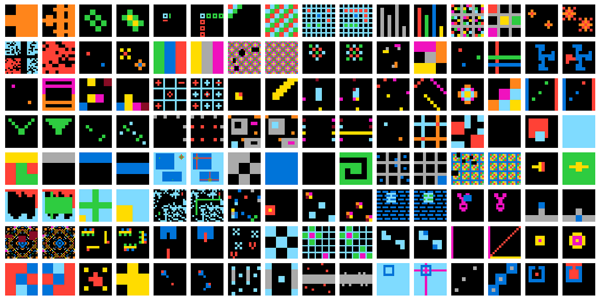

# ¿Qué es la Inteligencia?

_15/03/2023_

## Introducción

- Bienvenidos a la tertulia de la inteligencia artificial.
- Presentar tema del día
- Presentación Tertulianos (no olvidarme de mí mismo XD)
- Agradecer acogida y consejos para mejorar
- Preguntas y sugerencias de temas en twitter

## Tema en profundidad

### Definiciones de Inteligencia

Presentar distintas definiciones y discutir sobre su bondad y limitaciones

#### [RAE](https://dle.rae.es/inteligencia)

> 1. Capacidad de entender o comprender
> 2. Capacidad de resolver problemas

#### [Legg and Hutter](https://arxiv.org/abs/0706.3639)

> La inteligencia mide la habilidad de un agente de alcanzar metas en un amplio rango de ambientes

#### [Agente inteligente](https://es.wikipedia.org/wiki/Agente_inteligente_(inteligencia_artificial))

> Un agente inteligente es una entidad capaz de percibir su entorno, procesar tales percepciones y responder o actuar en su entorno de manera racional, es decir, de manera correcta y tendiendo a maximizar un resultado esperado

_Discutir sobre el hecho de actuar y maximizar un objetivo. ¿Un buda que no se mueve es inteligente?_

#### [Chollet](https://arxiv.org/abs/1911.01547)

> La inteligencia es la eficiencia en la adquisición de habilidades nuevas. Para poder medir la inteligencia hay que tener en cuenta:
>
> - los conocimientos y experiencias previas
> - dificultad de generalización
> - alcance

Un sistema es inteligente si resuelve problemas nuevos. Cuanto más se aleje el problema de la experiencia previa más inteligente es el sistema.
Cuanto más rápido aprenda el sistema más inteligente es.

Si consideramos dos sistemas que:

- empiezan con un conjunto similar de conocimientos y experiencias previas
- tienen el mismo tiempo para practicar una serie de tareas que no se conocían de antenamo

Al terminar el tiempo de práctica el sistema que demuestre una mayor habilidad en esas tareas es el más inteligente.

_p.e. si coges a una clase de niños, y les dejas practicar algunas tareas que no han hecho nunca: tocar el harpa, escribir en un teclado dvorak, aprender un idioma nuevo... y luego les haces un examen; el niño que saque mejor nota es el más inteligente. El problema aquí es que la premisa de que los conocimientos y sesgos iniciales son los mismos es muy dificil que se cumpla_

_los test de inteligencia intentan ser así, son pequeñas tareas que no hacemos con frecuencia. Si practicaramos para hacer mejor los tests de inteligencia conseguiríamos sacar mejores notas. Chascarrillo PAI del cole. Claro luego nos harían test de inteligencia a los del cole y seríamos los más inteligentes del mundo._

##### Generalización

> La generalización es la capacidad de manejar situaciones (o tareas) diferentes de las que nos hemos encontrado hasta el momento

Tipos de generalización:

- Local o robustez. La capacidad de funcionar ante casos nuevos de una distribución ya conocida.
- Amplia o flexibilidad. La capacidad de manejar situaciones que no han podido ser previstas por los creadores del sistema. P.e. conducción autónoma.
- Extrema. La capacidad de realizar tareas que solo comparten relaciones abstractas con las situaciones previamente encontradas

### Definiciones de inteligencia artificial

#### RAE

> Inteligencia artificial: Disciplina científica que se ocupa de crear programas informáticos que ejecutan operaciones comparables a las que realiza la mente humana, como el aprendizaje o el razonamiento lógico.

#### Marvin Minsky

> IA es la ciencia de hacer máquinas capaces de hacer tareas que requirirían inteligencia si las hicieran los humanos.

#### John McCarthy

> IA es la ciencia e ingeniería de hacer que las máquinas hagan tareas que nunca han visto y para las que no las han preparado de antemano

#### El Efecto IA

Las metas se van moviendo cada vez que hay un progreso en IA.

> Cuando averiguamos como una máquina puede hacer algo "inteligente", deja de ser considerado inteligente.

_cambio en la percepción de las personas cuando una tarea está resuelta por la IA_

### Tests de inteligencia

#### [Test de Turing](https://es.wikipedia.org/wiki/Prueba_de_Turing)

En los albores de la IA se propuso un test de para poder medir cuando una IA era comparable a la humana.

_¿Hemos superado el test de Turing? Google LaMDA, ChatGPT_

[Habitación china de searle](https://es.wikipedia.org/wiki/Habitaci%C3%B3n_china)

#### Deep Blue | Alphago | Alphastar

Estos modelos han ganado a los campeones del mundo, _¿pero nos han enseñado algo acerca de la inteligencia?, al margen de la poca robustez de algunos de estos agentes_

_¿Hay tests que pueden tener sentido en humanos pero no en máquinas?_

#### Test Wozniak 2010?

Hacer un café en una cocina cualquiera

#### [Watson Jeopardy 2011](https://en.wikipedia.org/wiki/IBM_Watson)

Ibm desarolló una IA para ganar un concurso de preguntas americano

#### [AnimalAI 2019](https://proceedings.mlr.press/v123/crosby20a.html)

#### Abstract and Reasoning Challenge

[On the Measure of Intelligence, François Chollet](https://arxiv.org/abs/1911.01547)

Discutir los puntos de vista del paper y el test que plantea.

> Para avanzar deliberadamente hacia sistemas artificiales más inteligentes y más parecidos a los humanos, necesitamos seguir una señal de retroalimentación adecuada: debemos ser capaces de definir y evaluar la inteligencia de una manera que permita comparaciones entre dos sistemas, así como comparaciones con los humanos.

<!-- -->

> Observamos que, en la práctica, la comunidad contemporánea de IA todavía tiende a evaluar la inteligencia comparando la habilidad exhibida por las IA y los humanos en tareas específicas, como juegos de mesa y videojuegos. Sostenemos que medir únicamente la habilidad en cualquier tarea dada no es suficiente para medir la inteligencia, porque la habilidad está fuertemente modulada por el conocimiento previo y la experiencia: los conocimientos previos ilimitados o los datos de entrenamiento ilimitados permiten a los experimentadores **"comprar"** niveles arbitrarios de habilidades para un sistema, de manera que oculta su propia capacidad de generalización.

_deliberar sobre la compra de niveles arbitrarios de habilidades_

> Agregar cada vez más datos a un sistema de aprendizaje de generalización local es ciertamente una estrategia adecuada si el objetivo final es la habilidad en la tarea considerada, pero no llevará a una generalización más allá de los datos que el sistema ha visto.

Esto parece ser cierto en el caso de ImageNet. Si extendemos el conjunto de datos buscando más imágenes para cada categoría, es muy probable que mejoremos la habilidad del sistema, pero no será más inteligente.

Sin embargo, no estoy seguro si esto es cierto para los Grandes Modelos de Lenguaje. Estos se entrenan con un objetivo muy general: predecir la siguiente palabra. Parece que para resolver esa tarea, el modelo necesita desarrollar muchas habilidades. En el artículo de Palm, dicen que si escalan el modelo y los datos, ven que emergen nuevas capacidades en el modelo.

_¿Y en el caso de las personas? ¿Me hace más inteligente aprender mucho sobre un tema, p.e. ajedrez? ¿Me hace más inteligente aprender sobre muchas tareas variadas? ¿O mi inteligencia ya está fijada?_

> Corpus de Abstracción y Razonamiento (ARC), construido sobre un conjunto explícito de conocimientos previos diseñados para ser lo más cercanos posible a los conocimientos previos humanos innatos. Sostenemos que ARC puede ser utilizado para medir una forma de inteligencia fluida general similar a la humana y que permite comparaciones justas de inteligencia general entre sistemas de IA y humanos.

Conocimientos previos: objetos, movimiento, contar, geometría básica, orientación a conseguir objetivos

### IA vs Inteligencia Humana

- Es inteligente un modelo que reconoce números? (NIST)
- Modelos generativos basados en texto. El lenguage permite una generalización mucho mayor que enfoques anteriores.

> Como humanos solo podemos demostrar una gran habilidad en una tarea específica si tenemos la facultad de adquirir habilidades en general. Si una persona juega muy bien al ajedrez podemos asumir que esa persona es inteligente, porque implicitamente sabemos que ha usado su inteligencia general para adquirir esta habilidad durante su vida (por lo que podría adquirir otras habilidades de la misma manera). Pero esta misma asunción no podemos hacerla a un sistema no humano.

### Superinteligencia (Nick Bostrom)

[3 tipos de superinteligencia](https://www.lesswrong.com/posts/semvkn56ZFcXBNc2d/superintelligence-5-forms-of-superintelligence):

- Más rápida. Una inteligencia humana pero que fuera 10, 100 veces más rápida.
- Colectiva. Una persona contra una empresa o un país.
- Cualitativa. Comparar la inteligencia de los hombres con los animales

## Recomendaciones

- Superintelligence de Nick Bostrom. Fringe y Música clásica de Jaime Altozano
- Solaris de Stanisław Lem
- La guía del autoestopista galáctico

## Despedida
