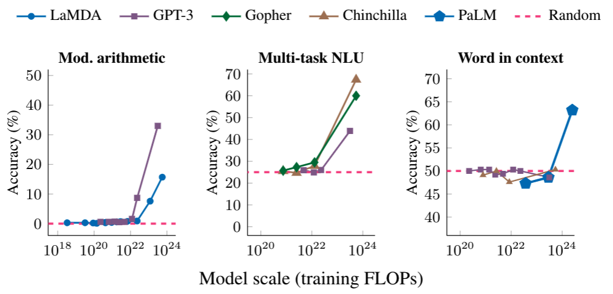
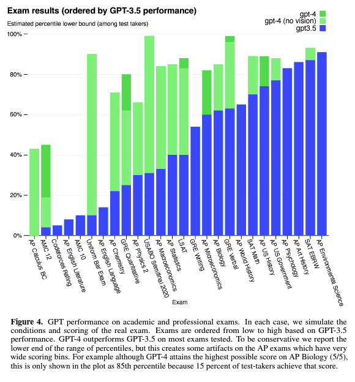
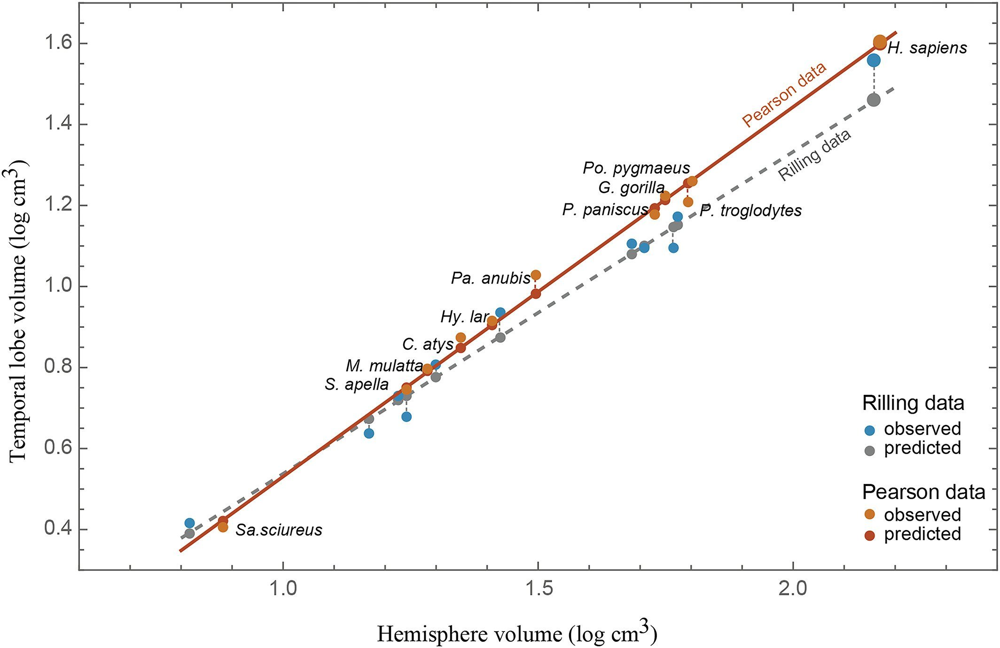

# Escala y Emergencia. ¿Destellos de Inteligencia Artificial General?

_12/04/2023_

La idea es que está tertulia sea más corta, algunos de los oyentes piden tertulias más cortas. Esto sería una prueba para ver que tal funciona un formato distinto. Debería ser de menos de una hora.

## Resumen

En los últimos años hemos visto la evolución de GPT2, GPT3 y ahora GPT4. Estos modelos han ido creciendo en tamaño y habilidades. ¿Es suficiente para llegar a la Inteligencia Artificial General continuar esta senda de entrenar modelos más grandes en cada vez más datos?

## Introducción

- Bienvenidos a la tertulia de la inteligencia artificial.
- Presentar tema del día (Resumen arriba)
- Este programa es posible gracias a Veridas (meter cuña publicitaria)

## Preguntas de los oyentes

https://twitter.com/carloslarriu/status/1640707355204616192?s=20

Respuesta:
  * Efectivamente, la neurociencia lleva largo tiempo apuntando a la importancia de la emocionalidad en la inteligencia y la toma de las artificiales. Referencia a Damasio (El error de Descartes) y su crítica al dualismo cartesiano de mente-cuerpo / razón-emoción.
  * En el desarrollo de la IA podríamos pensar de forma radical en dos aproximaciones antagónicas: 1) tratar de desentrañar la esencia de la inteligencia abstrayéndonos incluso del caso potencialmente particular de la inteligencia humana y a partir de ahí construir una inteligencia artificial; 2) tratar de desentrañar la esencia del cerebro humano para tratar de replicarlo artificialmente.
  * Realmente, en muchos de los desarrollos tecnológicos conseguidos históricamente, el ser humano se ha inspirado en la naturaleza pero no a costa de replicarla tal cual (ejemplo aviación). 
  * Opinión: tiene sentido tratar de inspirarse en factores claves en la inteligencia humana para tratar de lograr avances rompedores en la IA. Algunos ejemplos:
  * El salto que han dado los modelos de lenguaje gracias a los modelos [Transformers]([url](https://en.wikipedia.org/wiki/Transformer_(machine_learning_model))) para dotarles de atención al contexto. Acercan los modelos de lenguaje a la [hermenéutica]([url](https://es.wikipedia.org/wiki/Hermen%C3%A9utica)) humana en una especie de [círculo hermenéutico]([url](https://es.wikipedia.org/wiki/C%C3%ADrculo_hermen%C3%A9utico)) en el cual el propio entendimiento del texto se ve retroalimentado por el contexto del ínterprete y del propio texto. (Ver crítica de [Hubert Dreyfus]([url](https://es.wikipedia.org/wiki/Hubert_Dreyfus)) a los cuatro supuestos de la IA para más detalle sobre la importancia del contexto).
  * La importancia de la causalidad y los contrafactuales. Ver el libro del porqué de Judea Pearl (material para otro episodio del podcast).
  * ¿Cómo modelar la emoción y el sentimiento en la IA? (Muy relacionado con el tema de la emergencia de este episodio)

## Tema en profundidad

### Escala y emergencia

- [Emergencia Wikipedia](https://es.wikipedia.org/wiki/Emergencia_(filosof%C3%ADa))

#### Ejemplos emergencia

- Células -ser vivo
- Pájaros bandada
- Hormigas
- Mente vs Neuronas
- [Juego de la vida](https://es.wikipedia.org/wiki/Juego_de_la_vida)
- Sociedad vs persona (cohetes)
- [Social behaviour as an emergent property of embodied curiosity: a robotics perspective](https://www.ncbi.nlm.nih.gov/pmc/articles/PMC6452242/)

#### Escala en la sociedad humana

| año   | población |
|-------|-----------|
| -8000 | 8e6       |
| 0     | 2e8       |
| 2022  | 8e9       |

https://ourworldindata.org/grapher/population?yScale=log

La escala permite una mayor especialización de los trabajos. También aumenta el número de genios que pueden contribuir a avanzar la ciencia.

_¿Como sería el ritmo del avance científico si fueramos 1e11 personas? ¿O una civilización interplanetaria con 1e12?_

### Escala y emergencia en IA

#### Palm, capacidades emergentes

- [PaLM: Scaling Language Modeling with Pathways](https://arxiv.org/abs/2204.02311)
- [Pathways Language Model (PaLM): Scaling to 540 Billion Parameters for Breakthrough Performance](https://ai.googleblog.com/2022/04/pathways-language-model-palm-scaling-to.html?m=1)
- [Characterizing Emergent Phenomena in Large Language Models](https://ai.googleblog.com/2022/11/characterizing-emergent-phenomena-in.html)
- [Emergent Abilities of Large Language Models](https://openreview.net/pdf?id=yzkSU5zdwD)

> **Scaling laws**. Scaling up the size of language models often leads to improved performance and sample efficiency on a range of downstream NLP tasks. In many cases, the performance of a large language model can be predicted by extrapolating the performance trend of smaller models. For instance, the effect of scale on language model perplexity has been empirically shown to span more than seven orders of magnitude.
>
> On the other hand, performance for certain other tasks does not improve in a predictable fashion. For example, the GPT-3 paper showed that the ability of language models to perform multi-digit addition has a flat scaling curve (approximately random performance) for models from 100M to 13B parameters, at which point the performance jumped substantially.
>
> **emergent abilities**, which we define as abilities that are not present in small models but are present in larger models. The existence of such emergent abilities raises the question of whether additional scaling could potentially further expand the range of capabilities of language models.

> The ability to perform multi-step arithmetic (left), succeed on college-level exams (middle), and identify the intended meaning of a word in context (right) all emerge only for models of sufficiently large scale. The models shown include LaMDA, GPT-3, Gopher, Chinchilla, and PaLM.

Algunas de las capacidades emergentes de PaLM:

- Aritmetica de multiples pasos
- Preguntas de examen universitario
- Significado de una palabra según el contexto
- Explicaciones paso a paso “chain-of-thought prompting”

#### [GPT4](https://openai.com/research/gpt-4)

- Multimodal
- Clara mejora respecto a 3 y 3.5

- Desconocemos su tamaño, arquitectura, entrenamiento...

> It passes a simulated bar (lawyer) exam with a score around the top 10% of test takers; in contrast, GPT-3.5’s score was around the bottom 10%. (un examen que hace falta pasar para poder ejercer como abogado
> In a casual conversation, the distinction between GPT-3.5 and GPT-4 can be subtle. The difference comes out when the complexity of the task reaches a sufficient threshold—GPT-4 is more reliable, creative, and able to handle much more nuanced instructions than GPT-3.5.

- [Sparks of Artificial General Intelligence: Early experiments with GPT-4](https://arxiv.org/abs/2303.12712) 450 hojas!
- [Gary Markus: The Sparks of AGI? Or the End of Science?](https://garymarcus.substack.com/p/the-sparks-of-agi-or-the-end-of-science)
- [AI Explained Video: Sparks of AGI](https://youtu.be/Mqg3aTGNxZ0)
  - Unrestricted GPT4 model, not finetuned for safety
  - Able to use tools with minimal instructions
  - Generates images from text (SVG, TikZ, Javascript)
  - GPT-4 passes all stages of mock interviews for major tech companies (programming exercises)
  - 3d game development
  - virtual handyman
  - able to draw maps from descriptions
  - Theory of mind. Can build a mental model of what other people are thinking
  - Fails at jokes
- [AI Explained Video: Theory of Mind](https://www.youtube.com/watch?v=4MGCQOAxgv4)
  - Theory of mind (ToM), or the ability to impute unobservable mental states to others, is central to human social interactions, communication, empathy, self-consciousness, and morality.
  - We tested several language models using 40 classic false-belief tasks widely used to test ToM in humans. The models published before 2020 showed virtually no ability to solve ToM tasks. Yet, the first version of GPT-3 ("davinci-001"), published in May 2020, solved about 40% of false-belief tasks-performance comparable with 3.5-year-old children. Its second version ("davinci-002"; January 2022) solved 70% of false-belief tasks, performance comparable with six-year-olds. Its most recent version, GPT-3.5 ("davinci-003"; November 2022), solved 90% of false-belief tasks, at the level of seven-year-olds. GPT-4 published in March 2023 solved nearly all the tasks (95%). These findings suggest that ToM-like ability (thus far considered to be uniquely human) may have spontaneously emerged as a byproduct of language models' improving language skills.
  - Empathy and theory of mind are two different concepts that are often used interchangeably but they are not the same thing. Theory of mind (ToM) refers to the ability to attribute mental states to others, such as beliefs, intentions and desires1. Empathy, on the other hand, refers to the ability to infer and share the emotional experiences of another

### Futuro IA: scale is all you need?

Basta con ordenadores más potentes y entrenar con todo internet: audio, video, fotos, texto...?

- Nando freitas [game over flamingo](https://twitter.com/NandoDF/status/1523591529671012354)
- [Is the human brain just a scaled primate brain?](https://twitter.com/Tim_Dettmers/status/1637594465065119744?s=20)

- [DeepMind’s astounding new ‘Gato’ AI makes me fear humans will never achieve AGI](https://thenextweb.com/news/deepminds-astounding-new-gato-ai-makes-fear-humans-will-never-achieve-agi)

#### Petición para paralizar entrenamiento de modelos más grandes que GPT4

Firmada por Gary Markus, Elon Musk...

https://futureoflife.org/open-letter/pause-giant-ai-experiments/

> This does not mean a pause on AI development in general, merely a stepping back from the dangerous race to ever-larger unpredictable black-box models with emergent capabilities.

_Implicitamente están diciendo que "scale is all you need", ¿Es peligroso GPT4? ¿Hay que parar los entrenamientos? ¿Es realista pensar que una pausa es posible? ¿Va a parar China o va a redoblar esfuerzos?_

#### ¿Hay límites en el escalado de los LLM?

Los LLM tienen una visión muy reducida del mundo. Por ejemplo muchas cosas de sentido común no se ponen por escrito por ser obvias. (Proyecto Cyc)

Una analogía muy mala sería una persona completamente ciega de nacimiento que en su vida solo hubiera escuchado una voz que le lee todo el conocimiento escrito de internet. Sin poder preguntar ni interactuar, solo escuchar lo que le dice la voz y teniendo que aprender a predecir la siguiente palabra. A esta pobre persona le faltaría mucho conocimiento básico de nuestro mundo. (El sentido común)

#### LLM -> Large World Models

- [AI Explained Video: What's Left Before AGI? PaLM-E, 'GPT 4' and Multi-Modality](https://www.youtube.com/watch?v=EzEuylNSn-Q)

Al igual que entrenamos un LLM para predecir la siguiente palabra, podemos entrenar un LWM para predecir el próximo frame de un video (o el frame dentro de x tiempo). Esto es lo que hace nuestro cerebro inconscientemente en segundo plano. Y si algo no se ajusta a lo predicho atrae nuestra atención consciente.

GPT3 was trained on around 45TB of text. Every day 200k hours of video are uploaded to youtube which weight around 1PB, so when working with video the scale is totally different. Storage becomes an issue.

## Recomendaciones

- [AI Explained Youtube channel](https://www.youtube.com/@ai-explained-) Se ha creado en Enero de 2023 y ya tiene ~100k suscriptores.

## Despedida

<!-- 

Esto lo dejo comentado por el momento porque la idea es hacer una tertulia más corta que las anteriores

## Noticias de las últimas semanas

- GPT-4
- [Google Bard](https://bard.google.com/)
- [An important next step on our AI journey](https://blog.google/technology/ai/bard-google-ai-search-updates/)

-->
