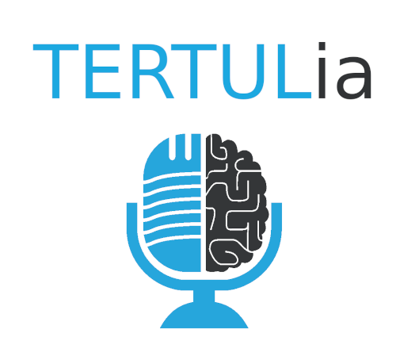

# La TERTULia de la Inteligencia Artificial

Podcast mensual en el que hablamos en profundidad sobre temas relacionados con la Inteligencia Artificial

Puedes escucharnos en:

- [Ivoox](https://go.ivoox.com/sq/1815311)
- [Spotify](https://open.spotify.com/show/2yxHFbLvZC16ZV8Of7I7qH)
- [Apple Podcasts](https://podcasts.apple.com/us/podcast/la-tertulia-de-la-inteligencia-artificial/id1669083682)
- [Youtube](https://www.youtube.com/@tertul_ia)

Déjanos tus preguntas en [Twitter](https://twitter.com/TERTUL_ia) y las responderemos al principio de cada programa!

## Objetivo

Tener una excusa para reunirnos periódicamente y hablar en profundidad de Inteligencia Artificial.

La idea sería intentar hacer un programa mensual en el que trataríamos uno o varios temas relacionados con la Inteligencia Artificial.
