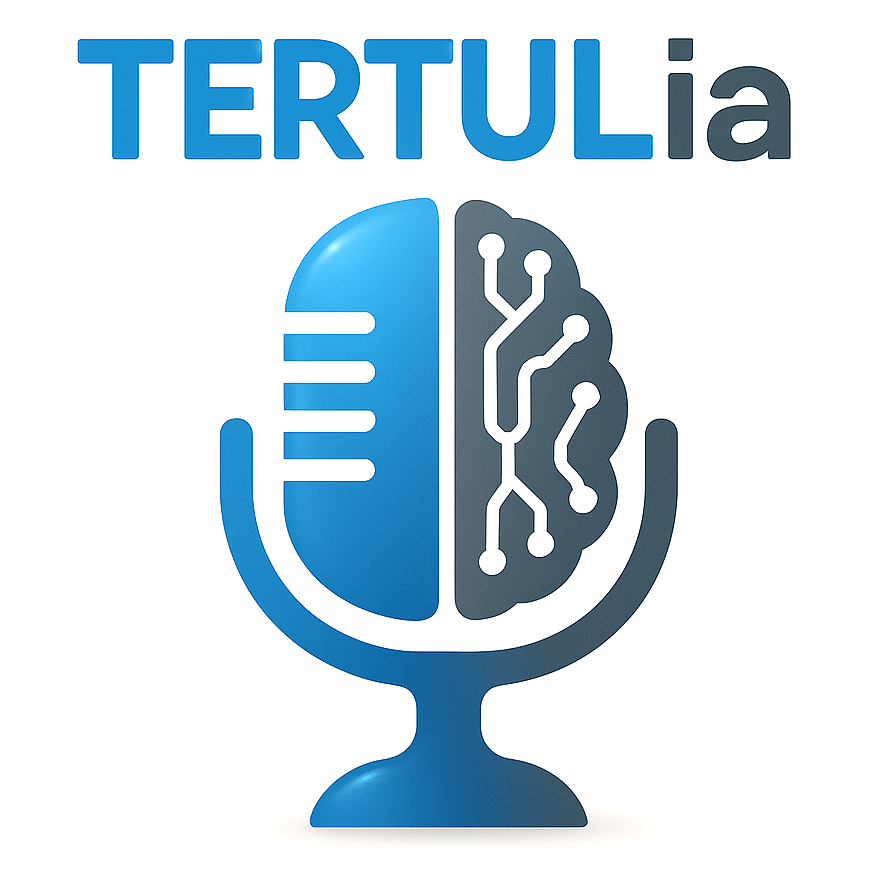

# La TERTUL**ia** de la Inteligencia Artificial

Podcast en el que hablamos **en profundidad** sobre temas relacionados con la Inteligencia Artificial.

Puedes escucharnos en:

- [ Spotify](https://open.spotify.com/show/2yxHFbLvZC16ZV8Of7I7qH)
- [ Youtube](https://www.youtube.com/@tertul_ia)
- [ Ivoox](https://go.ivoox.com/sq/1815311)
- [ Apple Podcasts](https://podcasts.apple.com/us/podcast/la-tertulia-de-la-inteligencia-artificial/id1669083682)

 

Puedes dejarnos dudas o sugerencias en [   Twitter](https://twitter.com/TERTUL_ia).

