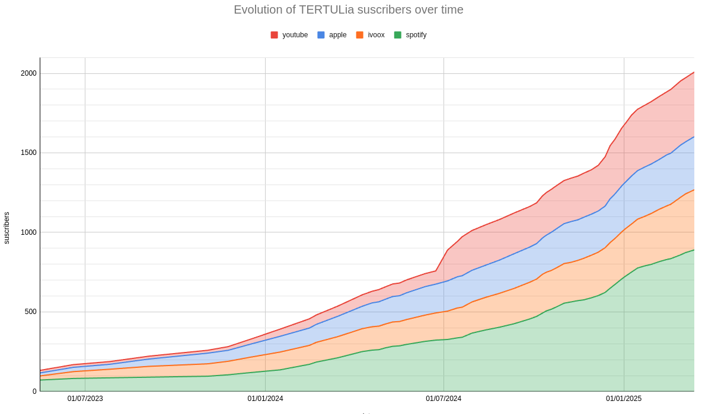
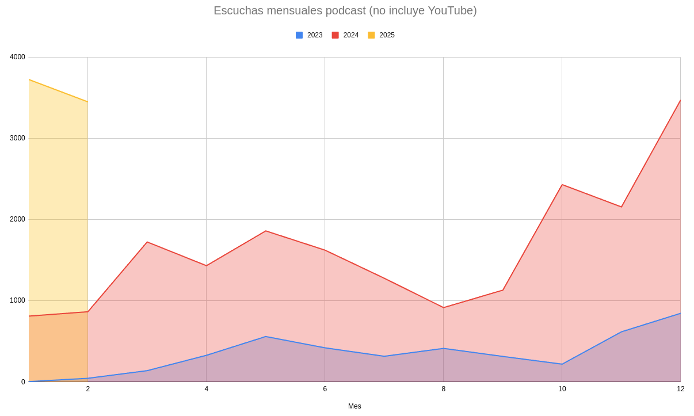

# 2º Aniversario y 2000 suscriptores

_15-04-2025_

¡Hace ya 2 años que grabamos el primer capítulo de la Tertulia de la Inteligencia Artificial! Durante este tiempo hemos grabado 47 programas, alcanzado la cifra de 2000 suscriptores y en los últimos meses tenemos de media más de 100 oyentes diarios del pódcast. Muchas personas han participado o ayudado a que la tertulia sea una realidad durante estos dos años, ¡así que mil gracias para todos ellos!

La tertulia nació como una excusa para juntarnos una vez al mes y hablar de IA, con la hipótesis de que quizá pudiera haber un público al que le interesara un análisis en profundidad de los avances en la IA. Programas como [Radio Skylab](https://x.com/radioskylab_es?lang=en) donde hablan de cohetes y del espacio fueron una fuente de inspiración, quizá podríamos hacer lo mismo y compartir nuestro conocimiento sobre IA.

Ese objetivo se está cumpliendo, estamos grabando todos los meses y nos lo pasamos bien. Mientras esto siga así seguirá habiendo tertulia.

## Aprendizajes

- Es mejor hacer varios capítulos cortos que uno largo. La queja más repetida que tuvimos tras la primera temporada fue que los capítulos eran demasiado largos. Tras eso hemos intentado organizar mejor los temas y dividirlos siempre que sea posible, apuntando a una duración promedio de unos 30 minutos frente a la hora larga que hacíamos en la primera temporada. 
- La dinámica de Youtube es muy distinta a Ivoox, Spotify o Apple. En Youtube las visitas son muy variables, hay videos con miles de visitas y otros con solo decenas. En cambio en las otras plataformas las visitas son muy estables y el crecimiento también. En Youtube es mucho más explosivo, de repente te toca la lotería con un capítulo y subes muchas visitas y seguidores.

## Números

### Suscriptores

Puede verse como en 01/07/2024 de repente suben mucho los suscriptores de Youtube, hasta entonces eran muy pocos.

### Escuchas mensuales

