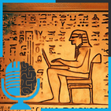

# Breve Historia de los Modelos de lenguaje, los antepasados de ChatGPT

- [ Ivoox](https://go.ivoox.com/rf/108546916)
- [ Youtube](https://youtu.be/bx4n-EAHYWE?si=7UNImU_jhubyJYAP)

¡Bienvenidos, fanáticos de la inteligencia artificial! Agarraos fuerte porque hoy nos vamos a montar en nuestra máquina del tiempo para un viaje de regreso a las raíces de los modelos de lenguaje.

En los últimos tres episodios, hemos estado charlando sobre los pesos pesados de la IA: los modelos GPT. Estoy seguro que te pica la curiosidad por saber de dónde salieron. ¿Cómo hemos llegado a tener estas bestias de la IA?

Hoy, vamos a desentrañar ese misterio. Vamos a bucear en la historia y descubrir cómo pasamos de simples herramientas para jugar con palabras a estos genios del lenguaje, versátiles y poderosos, que son los modelos GPT. Así que, ponte cómodo, coge tus palomitas, y prepárate para un viaje épico en el tiempo. ¡Vamos allá!

---

Este podcast está patrocinado por:  
