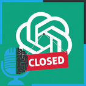

# OpenAI: de ONG a valer 30000 millones

- [ Ivoox](https://go.ivoox.com/rf/111043384)
- [ Youtube](https://youtu.be/BTPcBuGJ04A?si=gB0O8alsDYlrq4I2)

Hoy vamos a hablar de la trayectoria de OpenAI. Si quieres saber cómo OpenAI pasó de ser una ONG a una empresa valorada en 30 mil millones de dolares, controlada por Microsoft quédate con nosotros. Debatiremos cómo OpenAI se ha ido volviendo más secretista y cerrada con el tiempo, del valor del código abierto frente al valor de la accesibilidad y muchos temas más.

Participan en la tertulia: Íñigo Olcoz, Paco Zamora, Victor Goñi y Guillermo Barbadillo.

---

Este podcast está patrocinado por:  
