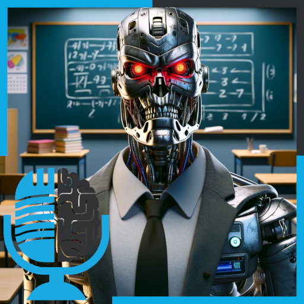

# Vigilancia en las aulas con Inteligencia Artificial

- [ Ivoox](https://go.ivoox.com/rf/121143131)
- [ Spotify](https://open.spotify.com/episode/4DwNH2NZIziX4IFuzIbtJP?si=HDgx2oWIQqKNOQa-ZjwGYg)
- [ Apple Podcasts](https://podcasts.apple.com/us/podcast/vigilancia-en-las-aulas-con-inteligencia-artificial/id1669083682?i=1000638655020)
- [ Youtube](https://youtu.be/I9k8nOL92ZY?si=akgSP3YDCZY7H4fs)
- [ Google Podcasts](https://podcasts.google.com/feed/aHR0cHM6Ly93d3cuaXZvb3guY29tL3BvZGNhc3QtdGVydHVsaWEtaW50ZWxpZ2VuY2lhLWFydGlmaWNpYWxfZmdfZjExODE1MzExX2ZpbHRyb18xLnhtbA/episode/aHR0cHM6Ly93d3cuaXZvb3guY29tLzEyMTE0MzEzMQ?sa=X&ved=0CAUQkfYCahcKEwi4_Ybm_ZCDAxUAAAAAHQAAAAAQAQ)

En esta segunda parte de Inteligencia Artificial y Educación nos adentramos en el lado más oscuro de la utilización de la tecnología en las aulas.

Participan en la tertulia: Íñigo Olcoz, Paco Zamora, Carlos Larríu, Victor Goñi y Guillermo Barbadillo.

Recuerda que puedes enviarnos dudas, comentarios y sugerencias en: <https://twitter.com/TERTUL_ia>

Más info en: <https://ironbar.github.io/tertulia_inteligencia_artificial/>

---

Este podcast está patrocinado por:  
