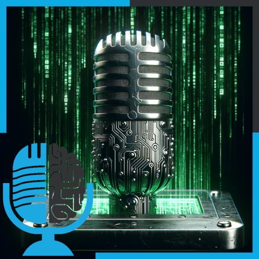

# La IA vista por el cine

- [ Ivoox](https://go.ivoox.com/rf/121521132)
- [ Spotify](https://open.spotify.com/episode/1OFBeGu895kSg200tSWW9t?si=7h1WHWqjR5iZnD15xItmfQ)
- [ Apple Podcasts](https://podcasts.apple.com/us/podcast/la-ia-vista-por-el-cine/id1669083682?i=1000639428765)
- [ Youtube](https://youtu.be/h7aYGzPHMcY?si=TOx9L8HzSsvG-fwU)
- [ Google Podcasts](https://podcasts.google.com/feed/aHR0cHM6Ly93d3cuaXZvb3guY29tL3BvZGNhc3QtdGVydHVsaWEtaW50ZWxpZ2VuY2lhLWFydGlmaWNpYWxfZmdfZjExODE1MzExX2ZpbHRyb18xLnhtbA/episode/aHR0cHM6Ly93d3cuaXZvb3guY29tLzEyMTUyMTEzMg?sa=X&ved=0CAUQkfYCahcKEwiQp-nC6aKDAxUAAAAAHQAAAAAQAQ)

En este programa especial navideño de la TERTULia analizamos películas donde aparece la inteligencia artificial: Matrix, 2001 una odisea en el espacio y Blade Runner

Participan en la tertulia: Íñigo Olcoz, Carlos Larríu, Victor Goñi y Guillermo Barbadillo.

Recuerda que puedes enviarnos dudas, comentarios y sugerencias en: <https://twitter.com/TERTUL_ia>

---

Este podcast está patrocinado por:  
