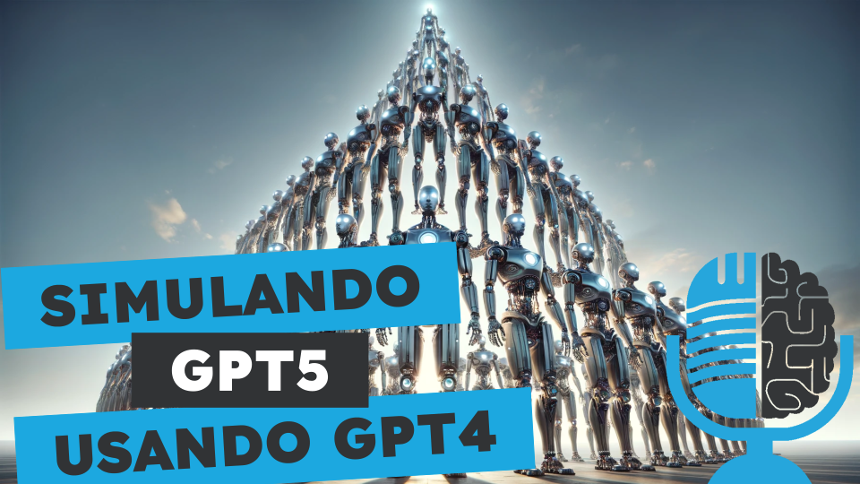

# Simulando GPT5, Cluster de Playstation 3 y elecciones EEUU

- [ Ivoox](https://go.ivoox.com/rf/123998715)
- [ Spotify](https://open.spotify.com/episode/4P37Q9kz0YHMhNJgwoSGmd?si=0Lv4adjzTwSS9NzOkv6HCQ)
- [ Apple Podcasts](https://podcasts.apple.com/us/podcast/simulando-gpt5-cluster-de-playstation-3-y-elecciones-eeuu/id1669083682?i=1000644719560)
- [ Youtube](https://youtu.be/tD1ksLyUrtw)
- [ Google Podcasts](https://podcasts.google.com/feed/aHR0cHM6Ly93d3cuaXZvb3guY29tL3BvZGNhc3QtdGVydHVsaWEtaW50ZWxpZ2VuY2lhLWFydGlmaWNpYWxfZmdfZjExODE1MzExX2ZpbHRyb18xLnhtbA/episode/aHR0cHM6Ly93d3cuaXZvb3guY29tLzEyMzk5ODcxNQ?sa=X&ved=0CAUQkfYCahcKEwjg2IDgz52EAxUAAAAAHQAAAAAQAQ)

Repasamos un estudio donde se muestra como podemos simular a GPT5 utilizando GPT4, comentamos una curiosa historia de como el ejercito de EEUU montó un superordenador utilizando Playstation 3 y finalmente analizamos el rol de la IA en las próximas elecciones de EEUU

Participan en la tertulia: Paco Zamora, Íñigo Olcoz, Carlos Larríu, Víctor Goñi y Guillermo Barbadillo.

Recuerda que puedes enviarnos dudas, comentarios y sugerencias en: <https://twitter.com/TERTUL_ia>

---

Este podcast está patrocinado por:  
