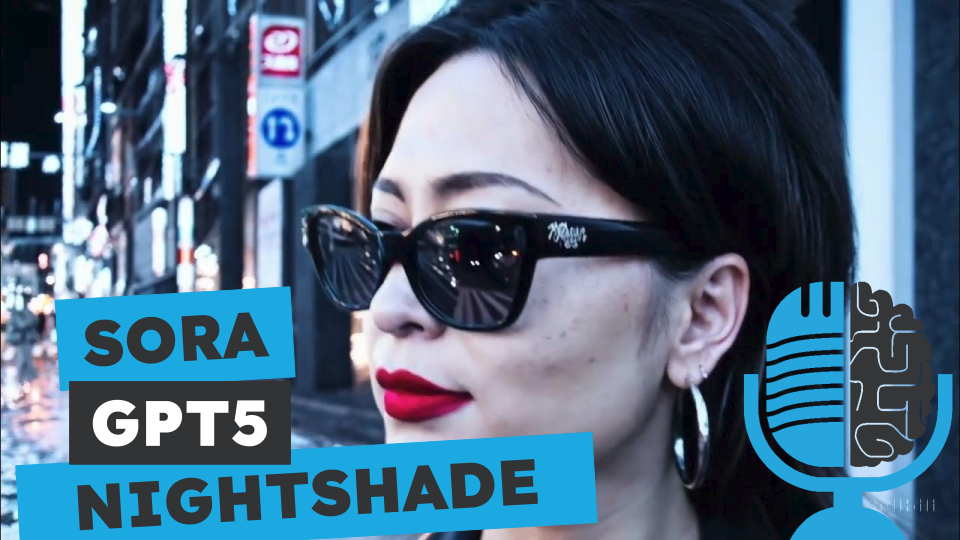

# Sora, Nightshade y GPT5

- [ Ivoox](https://go.ivoox.com/rf/125935367)
- [ Spotify](https://open.spotify.com/episode/2dwF6yV5ZicCowlwIWnCIl?si=XcvrMDLqTfaNRRYJHoB54g)
- [ Apple Podcasts](https://podcasts.apple.com/us/podcast/sora-nightshade-y-gpt5/id1669083682?i=1000649298462)
- [ Youtube](https://youtu.be/p-Rfd2hEFMQ)
- [ Google Podcasts](https://podcasts.google.com/feed/aHR0cHM6Ly93d3cuaXZvb3guY29tL3BvZGNhc3QtdGVydHVsaWEtaW50ZWxpZ2VuY2lhLWFydGlmaWNpYWxfZmdfZjExODE1MzExX2ZpbHRyb18xLnhtbA/episode/aHR0cHM6Ly93d3cuaXZvb3guY29tLzEyNTkzNTM2Nw?sa=X&ved=0CAUQkfYCahcKEwi46uyg-vWEAxUAAAAAHQAAAAAQAQ)

Sora, Nightshade y GPT5:

- Nigthshade es una herramienta diseñada para modificar imágenes imperceptiblemente para una persona, pero que envenenan a Stable Diffusion.
- Sora es el nuevo modelo de OpenAI que genera video con una calidad nunca vista.
- Comienzan a saltar rumores sobre GPT5

Estos tres temas, a fondo, en la tertulia.

Participan en la tertulia: Carlos Larríu, Víctor Goñi, Paco Zamora, Íñigo Olcoz y Guillermo Barbadillo.

Recuerda que puedes enviarnos dudas, comentarios y sugerencias en: <https://twitter.com/TERTUL_ia>

---

Este podcast está patrocinado por:  
