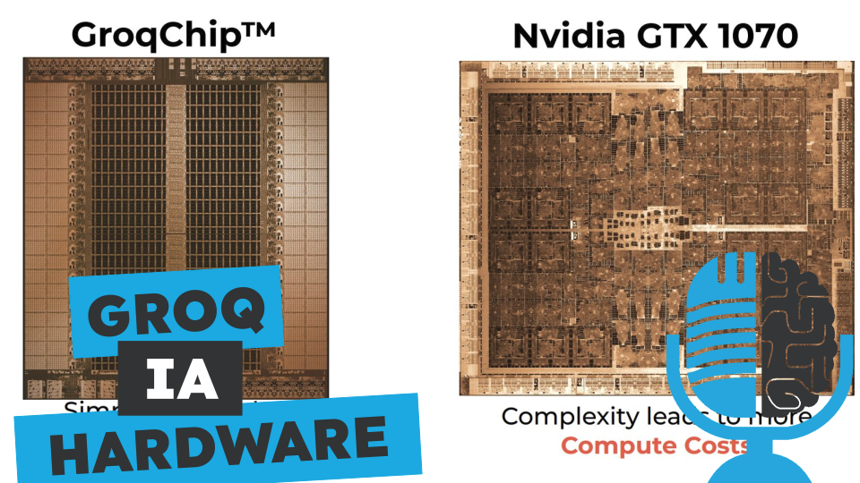

# Groq, más rápido que Nvidia

- [ Ivoox](https://go.ivoox.com/rf/127767684)
- [ Spotify](https://open.spotify.com/episode/6oPwlftDrAloe58QuKwnBY?si=IfaHDq0iQDS7v-HYmgdqsg)
- [ Apple Podcasts](https://podcasts.apple.com/us/podcast/groq-m%C3%A1s-r%C3%A1pido-que-nvidia/id1669083682?i=1000652956855)
- [ Youtube](https://youtu.be/ApLPFKM1XZ0)
- [ Google Podcasts](https://podcasts.google.com/feed/aHR0cHM6Ly93d3cuaXZvb3guY29tL3BvZGNhc3QtdGVydHVsaWEtaW50ZWxpZ2VuY2lhLWFydGlmaWNpYWxfZmdfZjExODE1MzExX2ZpbHRyb18xLnhtbA/episode/aHR0cHM6Ly93d3cuaXZvb3guY29tLzEyNzc2NzY4NA?sa=X&ved=0CAUQkfYCahcKEwj4lJCAi86FAxUAAAAAHQAAAAAQAQ)

Nvidia lleva años siendo el rey del Hardware de la inteligencia artificial. Pero de pronto ha aparecido Groq, una nueva empresa que ha diseñado un chip a la medida de los modelos de lenguaje y consigue que las respuestas sean 4 veces más rápidas. Hoy en la tertulia hablamos de Hardware y de Groq.

Participan en la tertulia: Víctor Goñi, Josu Gorostegui y Guillermo Barbadillo.

Recuerda que puedes enviarnos dudas, comentarios y sugerencias en: <https://twitter.com/TERTUL_ia>

---

Este podcast está patrocinado por:  
