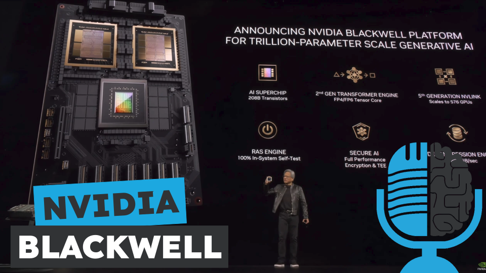

# Blackwell, la nueva arquitectura de Nvidia

- [ Ivoox](https://go.ivoox.com/rf/128082804)
- [ Spotify](https://open.spotify.com/episode/24jmEY44k4EYxhYTf6ekWT?si=VgZKoke4T7CY5wjXXPIpEg)
- [ Apple Podcasts](https://podcasts.apple.com/us/podcast/blackwell-la-nueva-arquitectura-de-nvidia/id1669083682?i=1000653668791)
- [ Youtube](https://youtu.be/92UxN0c7rws)
- [ Google Podcasts](https://podcasts.google.com/feed/aHR0cHM6Ly93d3cuaXZvb3guY29tL3BvZGNhc3QtdGVydHVsaWEtaW50ZWxpZ2VuY2lhLWFydGlmaWNpYWxfZmdfZjExODE1MzExX2ZpbHRyb18xLnhtbA/episode/aHR0cHM6Ly93d3cuaXZvb3guY29tLzEyODA4MjgwNA?sa=X&ved=0CAUQkfYCahcKEwjQzM_4y9-FAxUAAAAAHQAAAAAQAQ)

Para entrenar modelos como GPT4 hacen falta enormes clústers de tarjetas gráficas de Nvidia. El progreso en el desarrollo de la IA se pararía si  el hardware no siga mejorando y avanzando. GPT5 y GPT6 no serían posibles si Nvidia no saca nuevas tarjetas gráficas para su entrenamiento. Por eso hoy en la tertulia analizamos el lanzamiento de Blackwell, la nueva arquitectura de Nvidia.

Participan en la tertulia: Víctor Goñi, Josu Gorostegui y Guillermo Barbadillo.

Recuerda que puedes enviarnos dudas, comentarios y sugerencias en: <https://twitter.com/TERTUL_ia>

---

Este podcast está patrocinado por:  
