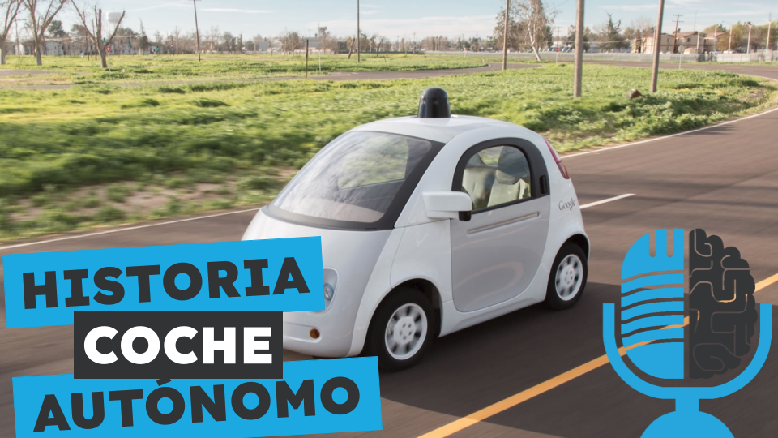

# Historia del coche autónomo

- [ Ivoox](https://go.ivoox.com/rf/128401236)
- [ Spotify](https://open.spotify.com/episode/7qrDqzaIpOdA6CmW5laA2v?si=0eczyQeKTJqId1fPhC_6-Q)
- [ Apple Podcasts](https://podcasts.apple.com/us/podcast/historia-del-coche-aut%C3%B3nomo/id1669083682?i=1000654427521)
- [ Youtube](https://youtu.be/c6taqpZWjIo)
- [ Google Podcasts](https://podcasts.google.com/feed/aHR0cHM6Ly93d3cuaXZvb3guY29tL3BvZGNhc3QtdGVydHVsaWEtaW50ZWxpZ2VuY2lhLWFydGlmaWNpYWxfZmdfZjExODE1MzExX2ZpbHRyb18xLnhtbA/episode/aHR0cHM6Ly93d3cuaXZvb3guY29tLzEyODQwMTIzNg?sa=X&ved=0CAUQkfYCahcKEwiA9frKsPGFAxUAAAAAHQAAAAAQAQ)

El coche autónomo ha sido noticia en los últimos años por los desarrollos de empresas como Tesla, Google y Apple. Pero, ¿sabías que las primeras investigaciones comenzaron en los años 30 del siglo pasado? Hoy en la tertulia hablamos sobre la historia del coche autónomo.

Participan en la tertulia: Paco Zamora, Íñigo Olcoz, Carlos Larríu, Leonardo de Maeztu y Guillermo Barbadillo.

Recuerda que puedes enviarnos dudas, comentarios y sugerencias en: <https://twitter.com/TERTUL_ia>

Más info en: <https://ironbar.github.io/tertulia_inteligencia_artificial/>

---

Este podcast está patrocinado por:  
