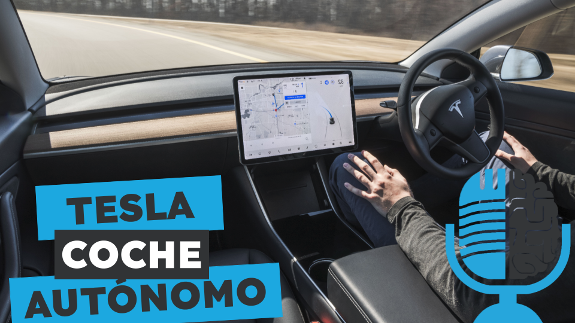

# El coche autónomo de Tesla

- [ Ivoox](https://go.ivoox.com/rf/128724378)
- [ Spotify](https://open.spotify.com/episode/5NHoUzYJijnWDhyqoU75aZ?si=uR3NxaFxRui2A76yVGybDg)
- [ Apple Podcasts](https://open.spotify.com/episode/5NHoUzYJijnWDhyqoU75aZ?si=uR3NxaFxRui2A76yVGybDg)
- [ Youtube](https://youtu.be/cD0t2EbrwLA)
- [ Google Podcasts](https://podcasts.google.com/feed/aHR0cHM6Ly93d3cuaXZvb3guY29tL3BvZGNhc3QtdGVydHVsaWEtaW50ZWxpZ2VuY2lhLWFydGlmaWNpYWxfZmdfZjExODE1MzExX2ZpbHRyb18xLnhtbA/episode/aHR0cHM6Ly93d3cuaXZvb3guY29tLzEyODcyNDM3OA?sa=X&ved=0CAUQkfYCahcKEwj43ImLm4OGAxUAAAAAHQAAAAAQAQ)

Tesla ha sido una de las empresas que más ha apostado por el desarrollo del coche autónomo. Bajo el liderazgo de Elon Musk mantiene una filosofía muy distinta a las otras marcas: no utilizar lidar y basarse únicamente en cámaras para percibir el entorno. Hoy en la tertulia hablamos del coche autónomo de Tesla.

Participan en la tertulia: Paco Zamora, Íñigo Olcoz, Carlos Larríu, Leonardo de Maeztu y Guillermo Barbadillo.

Recuerda que puedes enviarnos dudas, comentarios y sugerencias en: https://twitter.com/TERTUL_ia

---

Este podcast está patrocinado por:  
