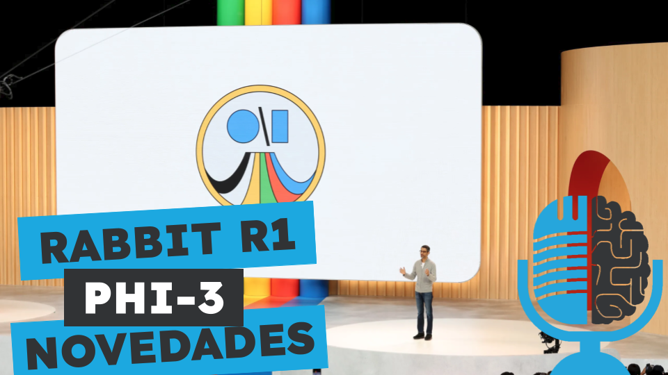

# Polemica Rabbit y presentaciones de OpenAI, Google y Microsoft

- [ Ivoox](https://go.ivoox.com/rf/130259883)
- [ Spotify](https://open.spotify.com/episode/2IDFRIHRDF7ZUDKypb34l5?si=VzZCSScrRzuUJpfWaJPPbQ)
- [ Apple Podcasts](https://podcasts.apple.com/us/podcast/pol%C3%A9mica-rabbit-y-presentaciones-de-openai-google-y/id1669083682?i=1000658783875)
- [ Youtube](https://youtu.be/AI6yUZyvP8I)
- [ Google Podcasts](https://podcasts.google.com/feed/aHR0cHM6Ly93d3cuaXZvb3guY29tL3BvZGNhc3QtdGVydHVsaWEtaW50ZWxpZ2VuY2lhLWFydGlmaWNpYWxfZmdfZjExODE1MzExX2ZpbHRyb18xLnhtbA/episode/aHR0cHM6Ly93d3cuaXZvb3guY29tLzEzMDI1OTg4Mw?sa=X&ved=0CAUQkfYCahcKEwiohd7HndaGAxUAAAAAHQAAAAAQAQ)

Hace 4 meses hablamos de Rabbit R1, que prometía un novedoso Large Action Model que ejecutaba acciones en internet automatizando tareas para los usuarios. Pero parece que todo era marketing y que hay conejo encerrado y hoy vamos a sacarlo de la chistera.
Por otra parte, repasamos las novedades presentadas recientemente por OpenAI, Google y Microsoft y nos centramos en Phi-3, un modelo de lenguaje que puede ejecutarse en tu móvil. 

Participan en la tertulia: Paco Zamora, Carlos Larríu y Guillermo Barbadillo.

Recuerda que puedes enviarnos dudas, comentarios y sugerencias en: https://twitter.com/TERTUL_ia

---

Este podcast está patrocinado por:  
