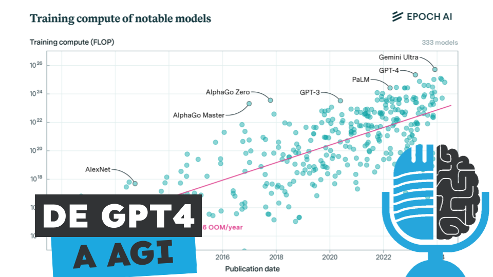

# De GPT2 a GPT4 y de GPT4 a AGI, la década que viene

- [ Ivoox](https://go.ivoox.com/rf/130968173)
- [ Spotify]()
- [ Apple Podcasts]()
- [ Youtube](https://youtu.be/MpKoSaLEb00)

Leopold Aschenbrenner es un ex-investigador de OpenAI que acaba de publicar un ensayo
en el que describe su visión de como será la próxima década en el desarrollo de la Inteligencia Artificial.
Hoy en la tertulia analizamos como en 4 años hemos pasado de GPT2 a GPT4, con un salto en las habilidades de los modelos impresionante, y veremos si un salto equivalente, dentro de 4 años, nos podría llevar a la Inteligencia Artificial General.

Fuente: https://situational-awareness.ai/

Participan en la tertulia: Josu Gorostegui, Víctor Goñi, Íñigo Olcoz y Guillermo Barbadillo.

---

Este podcast está patrocinado por:  
