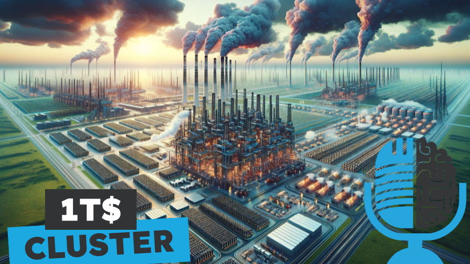

# Hacia el clúster del trillón de dólares, la década que viene

- [ Ivoox](https://go.ivoox.com/rf/131638117)
- [ Spotify](https://open.spotify.com/episode/6j9wmXZ9FYxFbEt1v5EAdV?si=OhnHoRs_SNq5aaR-J3jTTA)
- [ Apple Podcasts](https://open.spotify.com/episode/6j9wmXZ9FYxFbEt1v5EAdV?si=OhnHoRs_SNq5aaR-J3jTTA)
- [ Youtube](https://youtu.be/ld12i186zHw)

Para mantener el ritmo del progreso de la inteligencia artificial es necesario seguir aumentando
la capacidad de cómputo para entrenar modelos cada vez más grandes en bases de datos
cada vez más grandes. En su reciente ensayo, Leopold Aschenbrenner pronostica que dentro de 4
años se construirán clústers 1000 veces más potentes que los actuales. Hoy en la tertulia
analizamos el camino hacia el clúster del trillón de dólares.

Fuente: https://situational-awareness.ai/

Participan en la tertulia: Josu Gorostegui, Víctor Goñi, Íñigo Olcoz y Guillermo Barbadillo.

Recuerda que puedes enviarnos dudas, comentarios y sugerencias en: https://twitter.com/TERTUL_ia

---

Este podcast está patrocinado por:  
