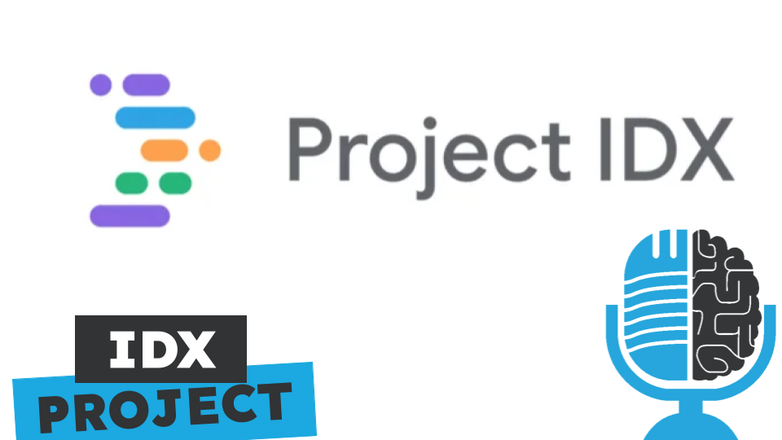

# IDX, el nuevo entorno de desarrollo en la nube de Google

- [ Ivoox](https://go.ivoox.com/rf/134251299)
- [ Spotify](https://open.spotify.com/episode/2Xhi4lvK6YSNQ5AZYPyKZG?si=MRK4V71xShqeLLtbCkbr_g)
- [ Apple Podcasts](https://podcasts.apple.com/us/podcast/idx-el-nuevo-entorno-de-desarrollo-en-la-nube-de-google/id1669083682?i=1000670940392)
- [ Youtube](https://youtu.be/UYfESZxxydA)

Cada desarrollador tiene su entorno de desarrollo favorito: vscode, xcode, emacs, android studio... Hasta ahora estos entornos se ejecutaban en local, en nuestro ordenador, poniendo las cosas difíciles si queremos desarrollar código, por ejemplo en una tablet. Pero Google ha lanzado el projecto IDX, un nueve entorno de desarrollo en la nube que además viene con Gemini integrado.  

Participan en la tertulia: Carlos Larríu, Paco Zamora, Víctor Goñi, Íñigo Olcoz y Guillermo Barbadillo.

Recuerda que puedes enviarnos dudas, comentarios y sugerencias en: <https://twitter.com/TERTUL_ia>
