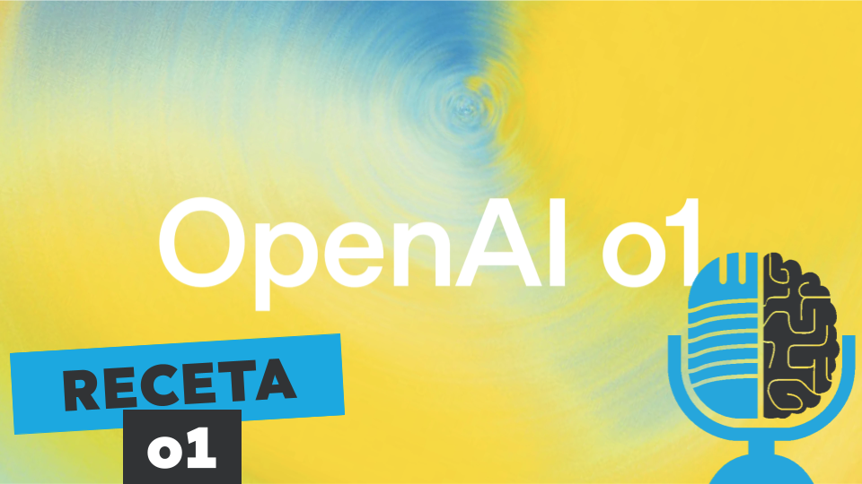

# La receta de o1

- [ Ivoox](https://go.ivoox.com/rf/134490940)
- [ Spotify](https://open.spotify.com/episode/0oZMOG41NF2iEoCSqkpuHi?si=NmCf5Hf_RNWxv052QgbtYA)
- [ Apple Podcasts](https://podcasts.apple.com/us/podcast/la-receta-de-o1/id1669083682?i=1000671769161)
- [ Youtube](https://youtu.be/scmTDVBMtXY)

o1 es la nueva apuesta de OpenAI, un modelo que dicen que es capaz de razonar y que resuelve algunos problemas mejor que estudiantes de doctorado. Pese a su nombre, OpenAI, no ha dado prácticamente ningún detalle de como se ha entrenado o1. Por eso hoy en la tertulia vamos a indagar cuál puede ser la receta para cocinar un o1.

Participan en la tertulia: Carlos Larríu, Paco Zamora, Víctor Goñi, Íñigo Olcoz y Guillermo Barbadillo.

Recuerda que puedes enviarnos dudas, comentarios y sugerencias en: <https://twitter.com/TERTUL_ia>