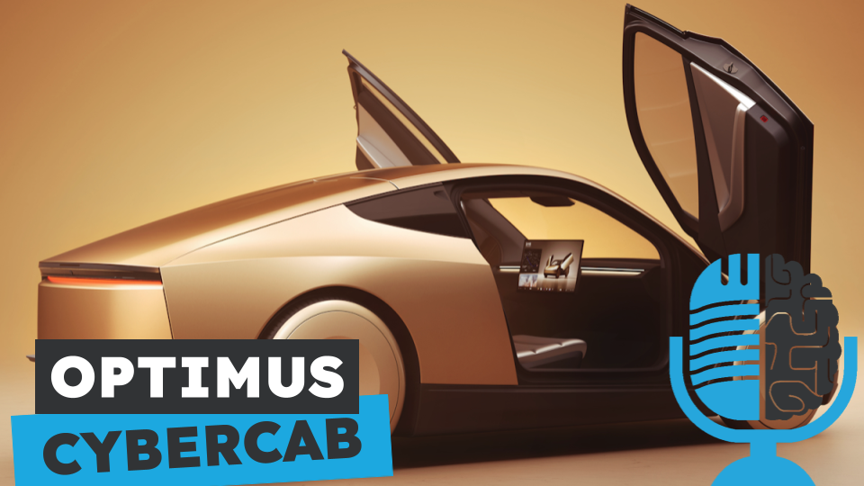

# Analizando el robotaxi de Tesla

- [ Spotify](https://open.spotify.com/episode/51dXlB2qqYQWWyzCs5itNo?si=dUtzfYe9ROG-XOhHzWo86A)
- [ Youtube](https://youtu.be/U1wvkfRaLqI)
- [ Ivoox](https://go.ivoox.com/rf/134834350)
- [ Apple Podcasts](https://podcasts.apple.com/us/podcast/analizando-el-robotaxi-de-tesla/id1669083682?i=1000673052217)

Tesla ha anunciado su robotaxi, el Cybercab, una mezcla entre el Cybertruck y los modelos más clásicos de Tesla. Hoy en la tertulia vamos a analizarlo junto al también anunciado Robovan y las actualizaciones al robot humanoide de Tesla, Optimus.

Participan en la tertulia: Leonardo de Maeztu, Josu Gorostegui y Guillermo Barbadillo.

Recuerda que puedes enviarnos dudas, comentarios y sugerencias en: <https://twitter.com/TERTUL_ia>