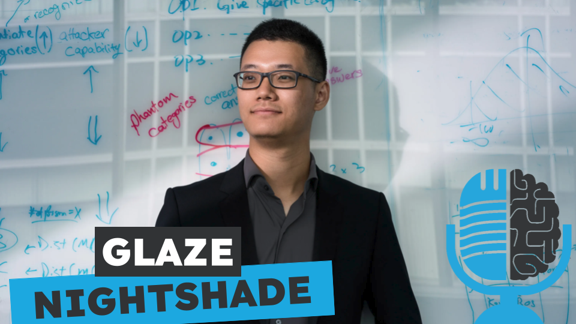

# Shawn Shan: creando herramientas contra la IA generativa

- [ Spotify](https://open.spotify.com/episode/0pljz4U91oEXP9NjE9hlie?si=jUV1GCO9Rp6A02IMEdK9NA)
- [ Youtube](https://youtu.be/Bt4hn0qSl3I)
- [ Ivoox](https://go.ivoox.com/rf/135214293)
- [ Apple Podcasts](https://podcasts.apple.com/us/podcast/shawn-shan-creando-herramientas-contra-la-ia-generativa/id1669083682?i=1000674403687)

El MIT ha nombrado a Shawn Shan como el innovador del año 2024. Shan ha creado herramientas como Glaze y Nightshade, que ayudan a los artistas digitales a proteger sus obras. Hoy en la tertulia analizamos estas herramientas y el impacto que están teniendo.

Participan en la tertulia: Carlos Larríu, Paco Zamora, Víctor Goñi, Íñigo Olcoz y Guillermo Barbadillo.

Recuerda que puedes enviarnos dudas, comentarios y sugerencias en: <https://twitter.com/TERTUL_ia>