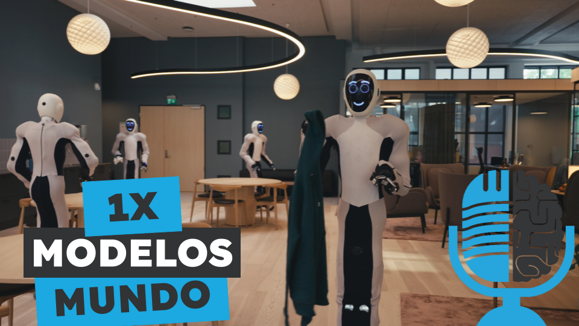

# 1X Modelos del Mundo

- [ Spotify](https://open.spotify.com/episode/3VFfbRYMwepr14VWxNY5eq?si=f1vKWdhtTtqEGlTak3gmNg)
- [ Youtube](https://youtu.be/pMhvfpnVjEI)
- [ Ivoox](https://go.ivoox.com/rf/135455538)
- [ Apple Podcasts](https://podcasts.apple.com/us/podcast/1x-modelos-del-mundo/id1669083682?i=1000675309312)

Imagina un robot que no solo entiende el mundo físico, sino que también simula sus propios movimientos, como si soñara sus acciones antes de ejecutarlas. En este episodio, hablamos sobre 1X, una compañía que construye robots humanoides y es pionera en el uso de la tecnología de Modelos del Mundo.

Participan en la tertulia: Paco Zamora, Íñigo Olcoz y Guillermo Barbadillo.

Recuerda que puedes enviarnos dudas, comentarios y sugerencias en: <https://twitter.com/TERTUL_ia>