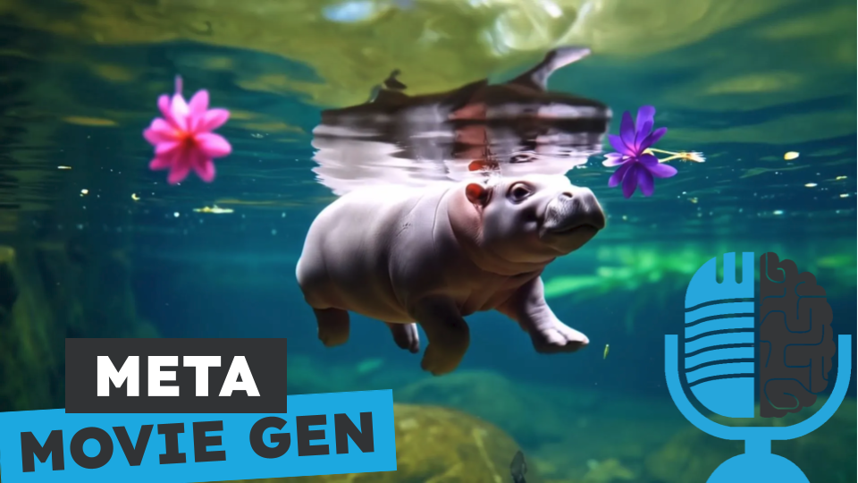

# Meta Movie Gen a fondo

- [ Spotify](https://open.spotify.com/episode/6jxGSVMzqo8K9qV302axtR?si=n4o7vAMhSf2UeT4VDwxunQ)
- [ Youtube](https://youtu.be/3iYIpJ-B4Cw)
- [ Ivoox](https://go.ivoox.com/rf/135693342)
- [ Apple Podcasts](https://podcasts.apple.com/us/podcast/meta-movie-gen-a-fondo/id1669083682?i=1000676186422)

Meta ha publicado un artículo de 96 páginas en el que describe como han entrenado Movie Gen, una familia de modelos que es capaz de: generar video a partir de texto, editar un video ya creado a partir de instrucciones de texto y generar videos personalizados si le damos una foto de nuestra cara. Si quieres conocer todos los detalles quédate, porque hoy te contamos Meta Movie Gen a fondo.

Participan en la tertulia: Paco Zamora, Íñigo Olcoz y Guillermo Barbadillo.

Recuerda que puedes enviarnos dudas, comentarios y sugerencias en: <https://twitter.com/TERTUL_ia>