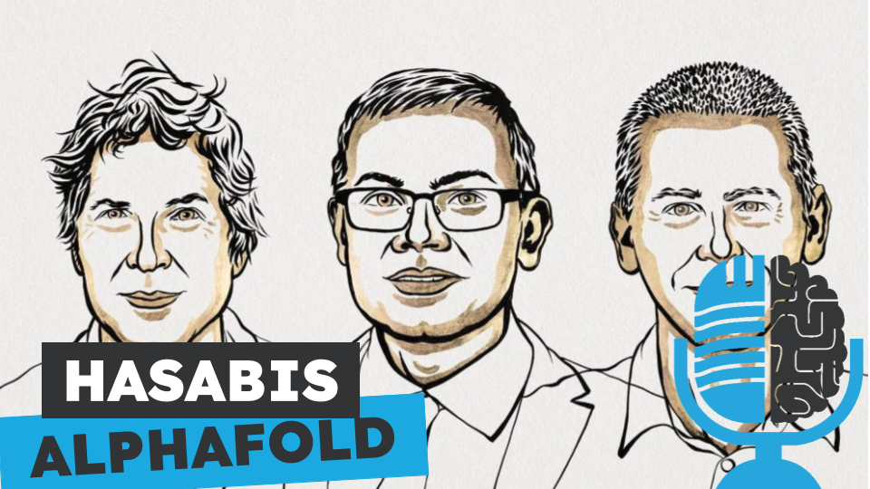

# Demis Hasabis, Alphafold y el Premio Nobel

- [ Spotify](https://open.spotify.com/episode/0TOH4CbmDgf25QzRfTCDgF?si=E1_bteuRSwOS6trerXNjzg)
- [ Youtube](https://youtu.be/miaeZbOn7yw)
- [ Ivoox](https://go.ivoox.com/rf/135942805)
- [ Apple Podcasts](https://podcasts.apple.com/us/podcast/demis-hasabis-alphafold-y-el-premio-nobel/id1669083682?i=1000677052967)

Aprovechando el reciente premio Nobel de Química otorgado a, entre otros, Demis Hasabis por su trabajo con Alphafold, hoy en la tertulia hacemos un repaso a la trayectoria de Hasabis y analizamos AlphaFold a fondo.

Participan en la tertulia: Paco Zamora, Íñigo Olcoz y Guillermo Barbadillo.

Recuerda que puedes enviarnos dudas, comentarios y sugerencias en: <https://twitter.com/TERTUL_ia>