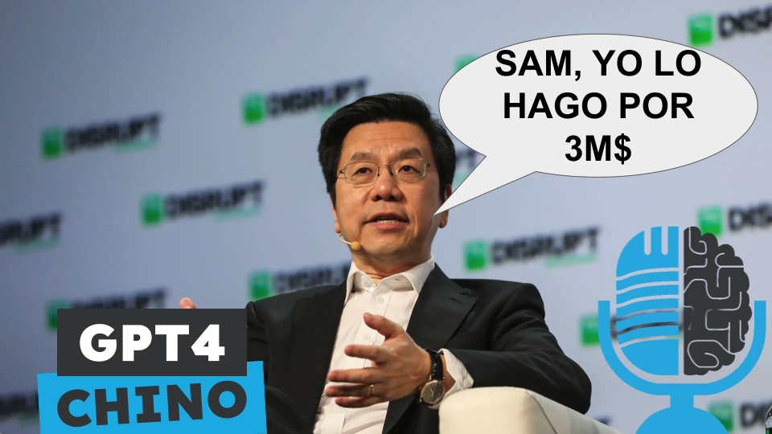

# Kai-Fu Lee y el GPT4 por 3M$

- [ Spotify](https://open.spotify.com/episode/3nz10QZEoJ2jqDddXjlro8?si=xkiE59JQSFasGY_Gg54scQ)
- [ Youtube](https://youtu.be/zoiCFzUm7qs)
- [ Ivoox](https://go.ivoox.com/rf/136417122)
- [ Apple Podcasts](https://podcasts.apple.com/us/podcast/kai-fu-lee-y-el-gpt4-por-3m%24/id1669083682?i=1000678647081)

Kai-Fu Lee es famoso por ser el autor del libro AI Superpowers. Recientemente, ha fundado la empresa 01, que se dedica a entrenar modelos fundacionales. En unas declaraciones recientes asegura que han entrenado un modelo llamado Yi-Lightning del nivel de GPT4 con tan solo 3 millones de dólares. Hoy en la tertulia periodismo de investigación: ¿Es Yi-Lightning un cuento chino?

Participan en la tertulia: Josu Gorostegui, Víctor Goñi y Guillermo Barbadillo.

Recuerda que puedes enviarnos dudas, comentarios y sugerencias en: <https://twitter.com/TERTUL_ia>