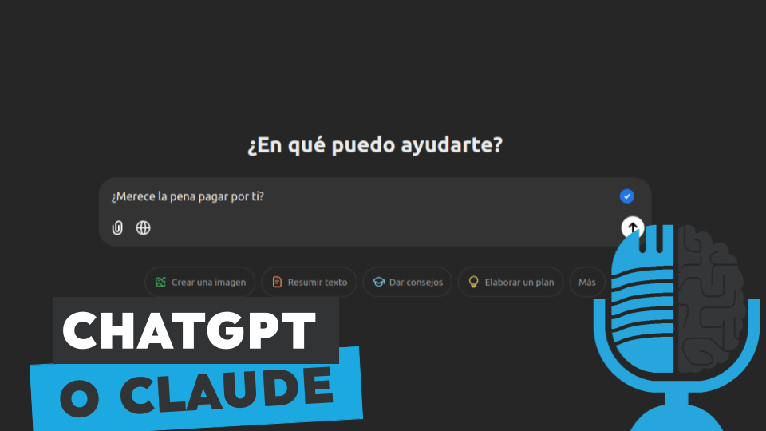

# ¿Merece la pena pagar en 2024 por ChatGPT?

- [ Spotify](https://open.spotify.com/episode/2Qx43b1Dnnhe1dMCy0hxUC?si=697GJAnOSIO8ziegrWwNYA)
- [ Youtube](https://youtu.be/C2q_X5Om5As)
- [ Ivoox](https://go.ivoox.com/rf/136644034)
- [ Apple Podcasts](https://podcasts.apple.com/us/podcast/merece-la-pena-pagar-en-2024-por-chatgpt/id1669083682?i=1000679481855)

ChatGPT, Gemini, Claude, Grok, Mistral, Perplexity... Hoy en día tenemos un gran abanico de chatbots, asistentes que podemos utilizar. Para complicar todavía más el tema, muchas de ellas ofrecen una versión gratuita y otra de pago. Hoy en la tertulia tratamos de responder la pregunta: ¿Merece la pena pagar en 2024 por ChatGPT?

Participan en la tertulia: Josu Gorostegui, Víctor Goñi y Guillermo Barbadillo.

Recuerda que puedes enviarnos dudas, comentarios y sugerencias en: <https://twitter.com/TERTUL_ia>