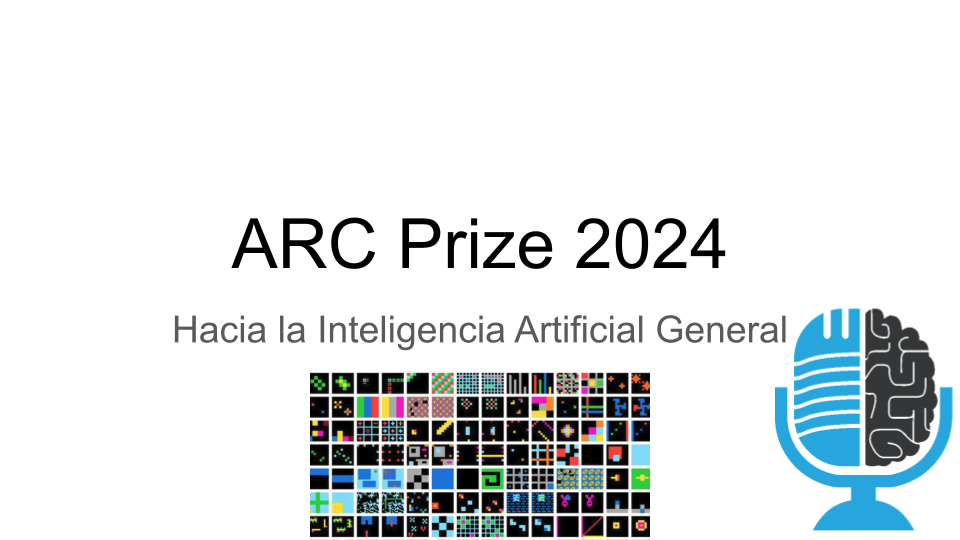

# ARC Prize 2024: Hacia la Inteligencia Artificial General

- [ Spotify](https://open.spotify.com/episode/6LR408QxKE7OnzAsejfT3d?si=iDjr05FJTfGb7voW2OO5Vg)
- [ Youtube](https://youtu.be/9W0qI1b5ZpE)
- [ Ivoox](https://go.ivoox.com/rf/136874733)
- [ Apple Podcasts](https://podcasts.apple.com/us/podcast/arc-prize-2024-hacia-la-inteligencia-artificial-general/id1669083682?i=1000680281390)

El Corpus de Abstracción y Razonamiento, más conocido como ARC, es un conjunto de test visuales de inteligencia que un niño de 5 años puede resolver, pero que se le resisten a los modelos más potentes de IA de hoy en día. Mientras los benchmarks que miden conocimiento general, matemáticas, físicas... están llegando saturar, ARC que se creó hace 5 años, ha resistido el paso del tiempo. ¿Por qué? Porque ARC está diseñado para medir la inteligencia, y los otros test lo que miden es habilidad. Hoy en la tertulia te cuento mi participación en el Premio ARC 2024, en el que he conseguido acabar en 2ª posición.

Participan en la tertulia: Guillermo Barbadillo.

Recuerda que puedes enviarnos dudas, comentarios y sugerencias en: <https://twitter.com/TERTUL_ia>