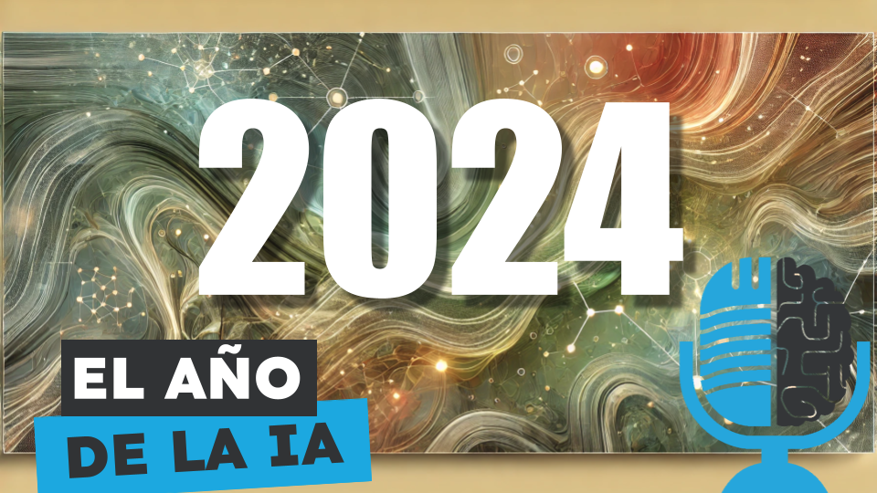

# Repaso a los INCREÍBLES avances en Inteligencia Artificial en 2024. Un año para la historia

- [ Spotify](https://open.spotify.com/episode/3xN3taZc37W3eWQy3zVzA5?si=US7d_Q79TpeFZcC8Vs34jA)
- [ Youtube](https://youtu.be/7nR0HCCUI2Y)
- [ Ivoox](https://go.ivoox.com/rf/137028581)
- [ Apple Podcasts](https://podcasts.apple.com/us/podcast/repaso-a-los-incre%C3%ADbles-avances-en-inteligencia/id1669083682?i=1000680845056)

La IA ha sido protagonista en 2024. Hemos vivido avances impresionantes en la generación de video con modelos como Sora, hemos visto los primeros pasos hacia los modelos de razonamiento con o1, ha sido el año de los premios nobel para la IA, Nvidia se ha convertido en la compañía más valorada del mundo... Hoy en la tertulia te contamos lo mejor y lo peor de la IA en 2024.

Participan en la tertulia: Paco Zamora, Íñigo Olcoz, Josu Gorostegui, Víctor Goñi y Guillermo Barbadillo.

Recuerda que puedes enviarnos dudas, comentarios y sugerencias en: <https://twitter.com/TERTUL_ia>