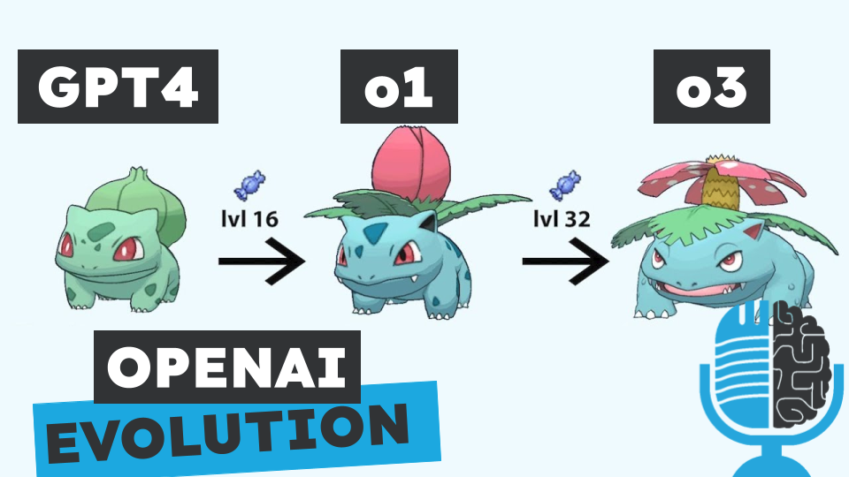

# o3, ¿autopista a la AGI?

- [ Spotify](https://open.spotify.com/episode/0yT1NDoiwGKqJcL9ALwPWi?si=1-q0O0-JQwOoj4uXvXC6PQ)
- [ Youtube](https://youtu.be/CTRCHN8aI70)
- [ Ivoox](https://go.ivoox.com/rf/137178656)
- [ Apple Podcasts](https://podcasts.apple.com/us/podcast/o3-autopista-a-la-agi/id1669083682?i=1000681441827)

OpenAI ha presentado su nuevo modelo de razonamiento: o3. Por primera vez una IA es capaz de resolver el reto de ARC, diseñado específicamente para medir la inteligencia y del que ya hemos hablado en capítulos anteriores. Pero contrariamente a su nombre, OpenAI nos ha dado muy pocos detalles y hay muchas incógnitas. Hoy tratamos de resolver la pregunta: ¿Es o3 el camino hacia la AGI?

Participan en la tertulia: Íñigo Olcoz, Josu Gorostegui, Carlos Larríu y Guillermo Barbadillo.

Recuerda que puedes enviarnos dudas, comentarios y sugerencias en: <https://twitter.com/TERTUL_ia>