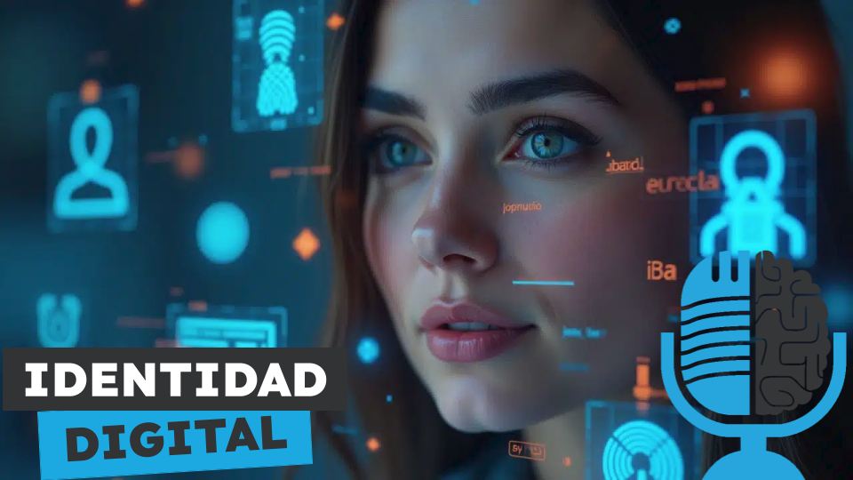

# Identidad digital y biometría

- [ Spotify](https://open.spotify.com/episode/4lu8T8npfO9WUxRKp3faBS?si=UNSNNwSyTp6NDvws65XTiA)
- [ Youtube](https://youtu.be/ck85eAWrC4k)
- [ Ivoox](https://go.ivoox.com/rf/139495492)
- [ Apple Podcasts](https://podcasts.apple.com/us/podcast/identidad-digital-y-biometr%C3%ADa/id1669083682?i=1000690223513)

La biometría es uno de los métodos que tenemos para acreditar nuestra identidad en el mundo digital. Gracias a los avances en inteligencia artificial, los sistemas biométricos han evolucionado mucho en los últimos años, consiguiendo una precisión en algunas situaciones sobrehumana. Hoy en la tertulia te contamos a fondo como funciona la biometría y los retos a los que se enfrenta.

Participan en la tertulia: Esteban Morrás, Leire Arbona, Paco Zamora, Íñigo Olcoz y Guillermo Barbadillo.

Recuerda que puedes enviarnos dudas, comentarios y sugerencias en: <https://twitter.com/TERTUL_ia>