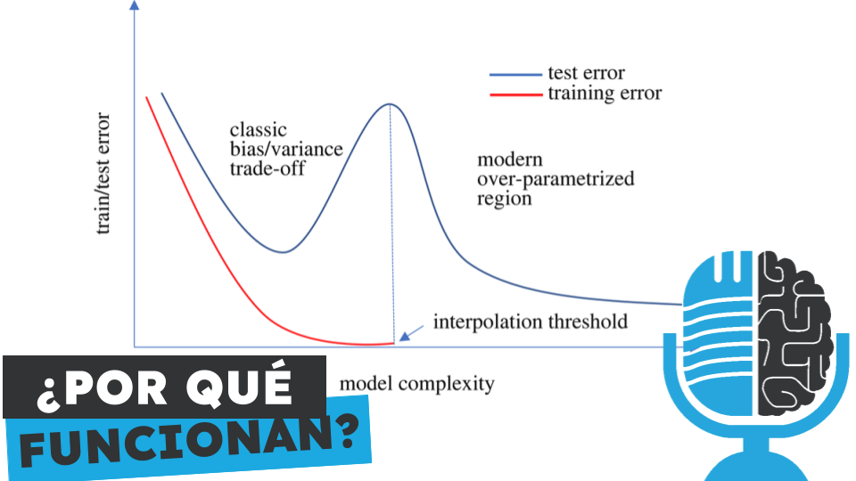

# La navaja de Ockham de las redes neuronales

- [ Spotify](https://open.spotify.com/episode/029qLpfNjxWrpXtaYQNOc2?si=dmUzPg57RoObuS3loMBrCA)
- [ Youtube](https://youtu.be/Xr9eyPY28sI)
- [ Ivoox](https://go.ivoox.com/rf/139867777)
- [ Apple Podcasts](https://podcasts.apple.com/us/podcast/la-navaja-de-ockham-de-las-redes-neuronales/id1669083682?i=1000692280689)

Las redes neuronales artificiales funcionan, pero es un misterio como modelos con un enorme número de parámetros son capaces de generalizar ante datos nuevos y no sobreaprender los datos de entrenamiento. Hoy en la tertulia analizamos un artículo que trata de explicar este misterio y que sugiere que las redes neuronales podrían tener dentro una navaja de Ockham.

Participan en la tertulia: Paco Zamora, Íñigo Olcoz, Carlos Larríu, Íñigo Orbegozo y Guillermo Barbadillo.

Recuerda que puedes enviarnos dudas, comentarios y sugerencias en: <https://twitter.com/TERTUL_ia>