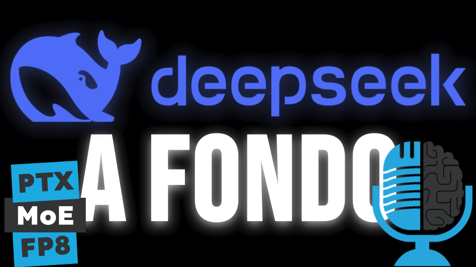

# DeepSeek V3 y R1: Un análisis técnico en profundidad

- [ Spotify](https://open.spotify.com/episode/5CE5BjJogQHbUzsyPsV5Ol?si=N0xH2CMaRX2M-__i3LbC8g)
- [ Youtube](https://youtu.be/bDLyn0JPafo)
- [ Ivoox](https://go.ivoox.com/rf/140788766)
- [ Apple Podcasts](https://podcasts.apple.com/us/podcast/deepseek-v3-y-r1-un-an%C3%A1lisis-t%C3%A9cnico-en-profundidad/id1669083682?i=1000696824224)

Seguro que has escuchado ya un montón de noticias relacionadas con DeepSeek, todos los grandes medios se han hecho eco de como una empresa china ha hecho público un modelo que compite de tú a tú con OpenAI y que ha costado menos de 10 millones de euros. Si quieres conocer a fondo, en profundidad, los detalles y las claves de DeepSeek V3 y R1, quédate que te los contamos.

Participan en la tertulia: Íñigo Olcoz, Carlos Larriu, Victor Goñi, Josu Gorostegui y Guillermo Barbadillo.

Recuerda que puedes enviarnos dudas, comentarios y sugerencias en: <https://twitter.com/TERTUL_ia>