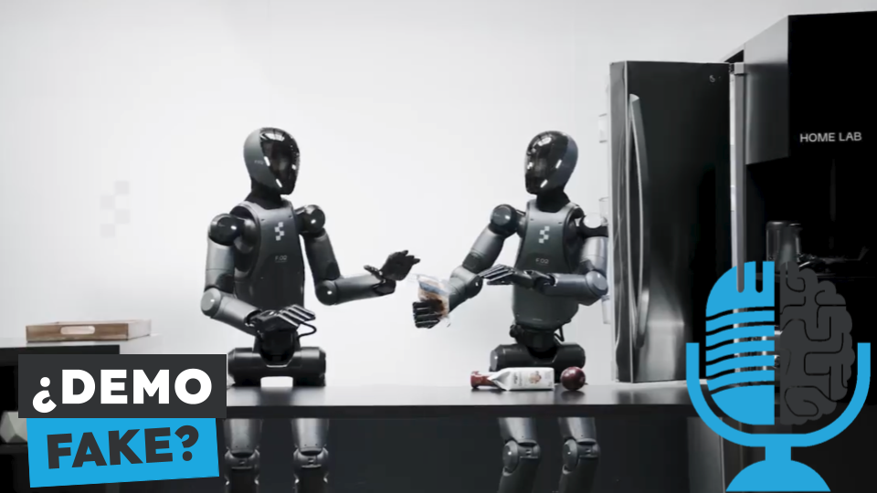

# Figure Helix: Cómo controlar a tu robot

- [ Spotify](https://open.spotify.com/episode/5HSiBO4xlKPmdh8aEzEtZK?si=VQafv2KZS1a2DH6JFukcNg)
- [ Youtube](https://youtu.be/7NqEP1rEKJk)
- [ Ivoox](https://go.ivoox.com/rf/141105646)
- [ Apple Podcasts](https://podcasts.apple.com/us/podcast/figure-helix-c%C3%B3mo-controlar-a-tu-robot/id1669083682?i=1000697894274)

Los robots humanoides de Figure son unos de los más avanzados del mundo. Hasta hace muy poco colaboraban con OpenAI para dotar de inteligencia a sus robots, pero ahora han empezado a desarrollar su propia IA y nos lo demuestran con una demo en apariencia muy impresionante. Hoy en la tertulia te contamos como funcionan los robots de Figure

Participan en la tertulia: Íñigo Olcoz, Víctor Goñi, Josu Gorostegui, Imanol Solano y Guillermo Barbadillo.

Recuerda que puedes enviarnos dudas, comentarios y sugerencias en: <https://twitter.com/TERTUL_ia>