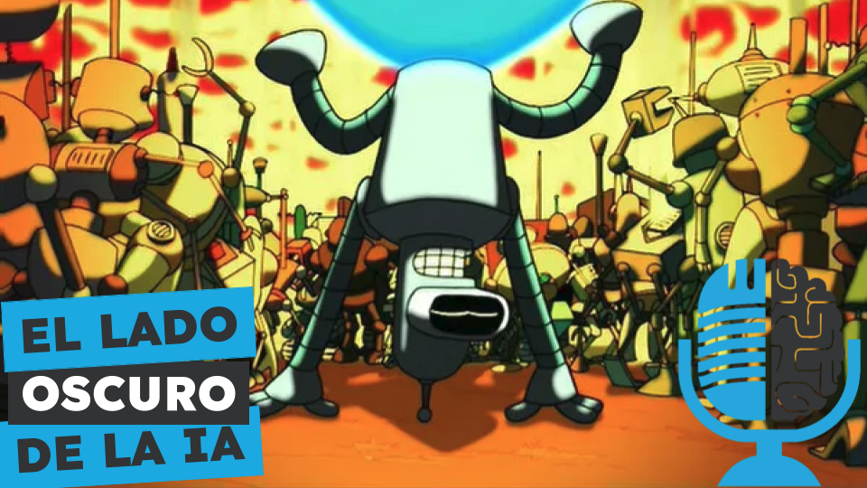

# Retos planetarios de la IA: Impacto ambiental, trabajo y datos

- [ Spotify](https://open.spotify.com/episode/4Zl2QPKcv8Di2yaiOGKhgA?si=QNRKP-MFSH-7TsDpqLK3cQ)
- [ Youtube](https://youtu.be/wdLb68EnQRw)
- [ Ivoox](https://go.ivoox.com/rf/141636961)
- [ Apple Podcasts](https://podcasts.apple.com/us/podcast/retos-planetarios-de-la-ia-impacto-ambiental-trabajo/id1669083682?i=1000699196623)

Los grandes gurús de la IA a menudo nos hablan de los peligros de una superinteligencia artificial fuera de control. Pero al margen de estos hipotéticos futuros peligros, a día de hoy existen problemas reales provocados por la IA de los que se habla mucho menos. El uso masivo de recursos minerales, gasto energético, trabajos precarios... Hoy en la tertulia hablamos del lado oscuro de la IA

Participan en la tertulia: Íñigo Olcoz, Víctor Goñi, Josu Gorostegui, Imanol Solano y Guillermo Barbadillo.

Recuerda que puedes enviarnos dudas, comentarios y sugerencias en: <https://twitter.com/TERTUL_ia>