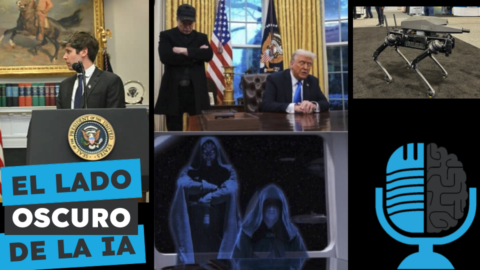

# Retos planetarios de la IA: estado y poder

- [ Spotify](https://open.spotify.com/episode/2KVCpExNgNA9qIBwFRZfzr?si=IRyTfHngQcur4gbCKXDjAQ)
- [ Youtube](https://youtu.be/Wt1tk8keZxM)
- [ Ivoox](https://go.ivoox.com/rf/143569728)
- [ Apple Podcasts](https://podcasts.apple.com/us/podcast/retos-planetarios-de-la-ia-estado-y-poder/id1669083682?i=1000700289513)

Esta es la segunda parte de nuestro especial sobre los retos planetarios de la IA. Como en el capítulo anterior nos centramos en los problemas reales que existen a día de hoy, no en los hipotéticos riesgos futuros de Skynet. En el comienzo de la nueva legislatura de Trump hemos podido ver como todos los directivos de las grandes empresas tecnológicas acudían a congraciarse con él. Hoy en la tertulia hablamos de la relación de la IA con el estado y el poder.

Participan en la tertulia: Íñigo Olcoz, Víctor Goñi, Josu Gorostegui, Imanol Solano y Guillermo Barbadillo.

Recuerda que puedes enviarnos dudas, comentarios y sugerencias en: <https://twitter.com/TERTUL_ia>