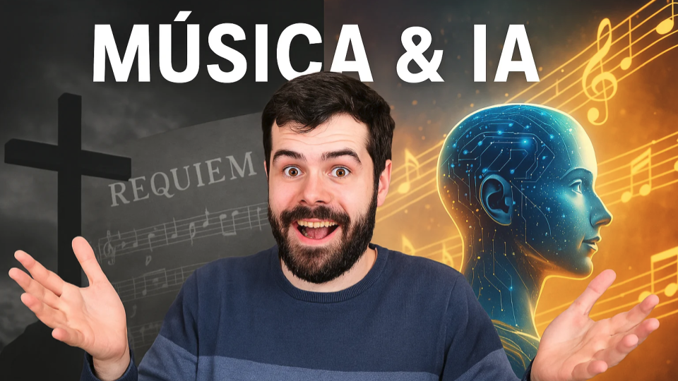

# Música & IA: Réquiem o Sinfonía

- [ Spotify](https://open.spotify.com/episode/4Mx9L37saAzFxNLtsWXM4v?si=TrVxzOoxRh62K15hSqyNkw)
- [ Youtube](https://youtu.be/sMctPPupFc8)
- [ Ivoox](https://go.ivoox.com/rf/144442966)
- [ Apple Podcasts](https://podcasts.apple.com/us/podcast/m%C3%BAsica-ia-r%C3%A9quiem-o-sinfon%C3%ADa/id1669083682?i=1000702219056)

La Inteligencia Artificial está revolucionando la creación musical, pero ¿estamos ante una nueva era de democratización artística o ante una banalización del arte que podría deteriorar la calidad musical? En este episodio exploramos cómo la tecnología desafía el concepto mismo de autoría y expresión, recordando que, al final, la música debe prevalecer porque el ser humano debe prevalecer.

Participan en la tertulia: Íñigo Olcoz, Josu Gorostegui, Carlos Larriu y Guillermo Barbadillo.

Recuerda que puedes enviarnos dudas, comentarios y sugerencias en: <https://twitter.com/TERTUL_ia>