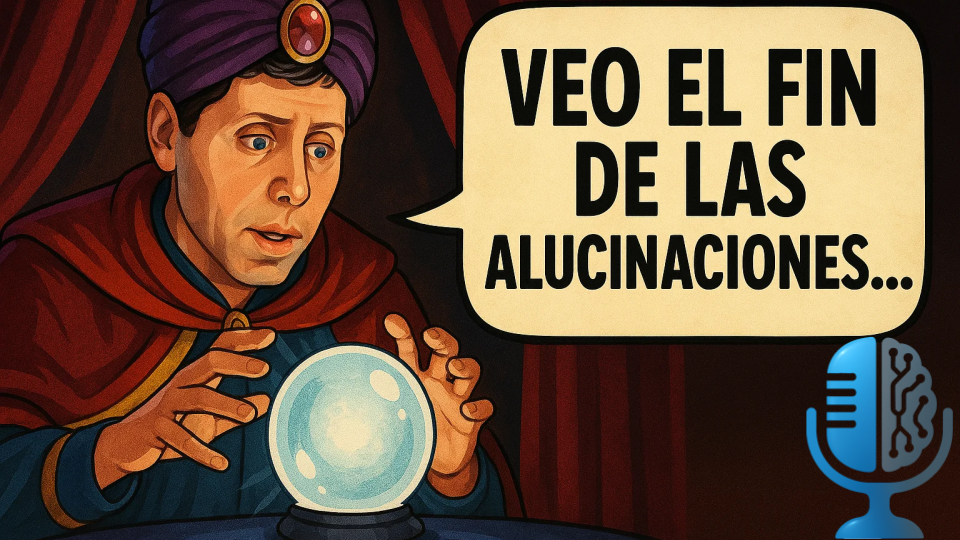

# Predicciones fallidas sobre la IA, el futuro no es lo que era

- [ Spotify](https://open.spotify.com/episode/0Ze4xXThlZvi24wck17cjz?si=Oz7q87UkTT-08RgI2wbPvQ)
- [ Youtube](https://youtu.be/UOPlf9GmMXk)
- [ Ivoox](https://go.ivoox.com/rf/144838566)
- [ Apple Podcasts](https://podcasts.apple.com/us/podcast/predicciones-fallidas-sobre-la-ia-el-futuro-no-es-lo-que-era/id1669083682?i=1000703133468)

La Inteligencia Artificial está llena de promesas, pero también de predicciones fallidas. Desde Elon Musk con la conducción autónoma hasta expertos anunciando el fin de los programadores, hoy repasamos las profecías tecnológicas que nunca llegaron. Porque si algo nos enseña la historia es que, en inteligencia artificial, el futuro nunca es lo que era.

Participan en la tertulia: Íñigo Olcoz, Josu Gorostegui y Guillermo Barbadillo.

Recuerda que puedes enviarnos dudas, comentarios y sugerencias en: <https://twitter.com/TERTUL_ia>