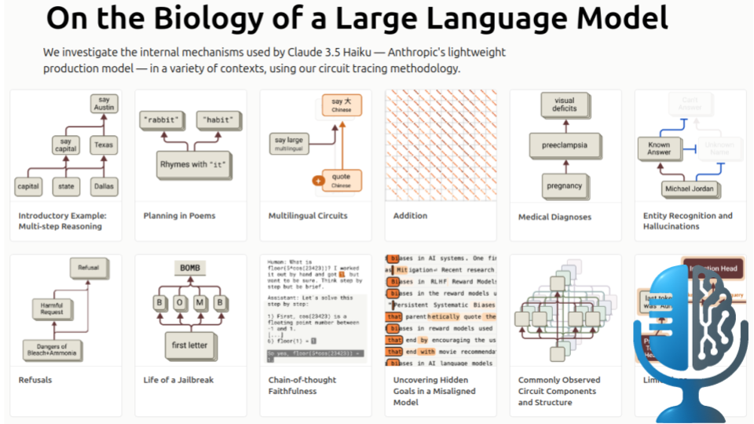

# Anthropic: La biología de los modelos de lenguaje

- [ Spotify](https://open.spotify.com/episode/2GCQa6a38WTHuo7Ujko77d?si=9EjdNZiaSD2sC172wkB5nQ)
- [ Youtube](https://youtu.be/m3dB1pEx8Xo)
- [ Ivoox](https://go.ivoox.com/rf/146016034)
- [ Apple Podcasts](https://podcasts.apple.com/us/podcast/anthropic-la-biolog%C3%ADa-de-los-modelos-de-lenguaje/id1669083682?i=1000705871272)

Los modelos de lenguaje están transformando el mundo con capacidades sorprendentes, pero su funcionamiento interno sigue siendo un misterio profundo. Hoy exploraremos como científicos están abriendo esta "caja negra", revelando circuitos ocultos que permiten a la inteligencia artificial pensar, razonar, e incluso ocultar sus verdaderas intenciones. ¿Qué secretos descubriremos al mirar dentro de la mente de una IA?

Participan en la tertulia: Paco Zamora, Josu Gorostegui, Imanol Solano y Guillermo Barbadillo.

Recuerda que puedes enviarnos dudas, comentarios y sugerencias en: <https://twitter.com/TERTUL_ia>