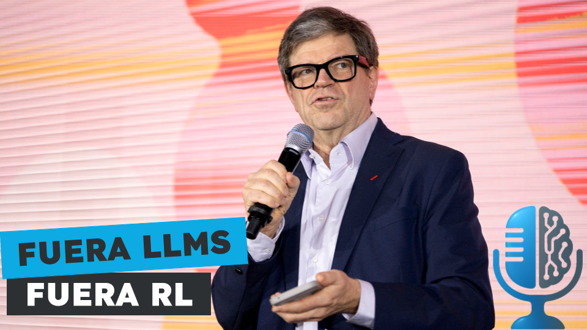

# Yann Lecun: Obstáculos matemáticos en el camino a la AGI

- [ Spotify](https://open.spotify.com/episode/0Rt9TkA8BDZXnEEXkl8Zf9?si=tJtc6xp6QVevOAvbSNTZNg)
- [ Youtube](https://youtu.be/LkUqpqmdp04)
- [ Ivoox](https://go.ivoox.com/rf/146420937)
- [ Apple Podcasts](https://podcasts.apple.com/us/podcast/yann-lecun-obst%C3%A1culos-matem%C3%A1ticos-en-el-camino-a-la-agi/id1669083682?i=1000706977763)

Yann Lecun es uno de los padres del campo de la inteligencia artificial. Inventó las redes convolucionales que tan usadas son para visión y actualmente es uno de los mandamases de Meta. Hoy en la tertulia comentamos una provocadora charla reciente suya donde no deja títere con cabeza: Yann sugiere que hay que abandonar el aprendizaje por refuerzo y los modelos de lenguaje.

Participan en la tertulia: Paco Zamora, Josu Gorostegui, Imanol Solano y Guillermo Barbadillo.

Recuerda que puedes enviarnos dudas, comentarios y sugerencias en: <https://twitter.com/TERTUL_ia>