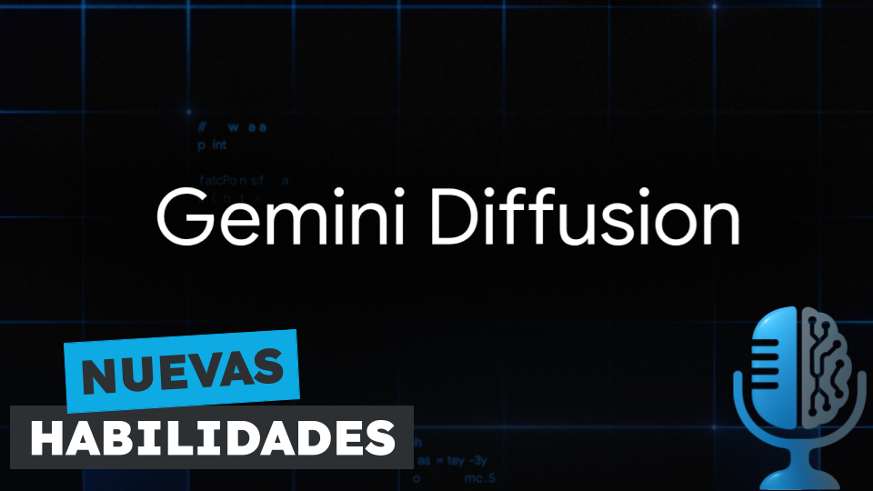

# Modelos de Difusión de Lenguaje: Gemini Diffusion

- [ Spotify](https://open.spotify.com/episode/21kqILIBqi0RlLKZOUduXV?si=VQOHQIbZTdyoUekNvIXpxg)
- [ Youtube](https://youtu.be/p8M1yIW_DAU)
- [ Ivoox](https://go.ivoox.com/rf/148823045)
- [ Apple Podcasts](https://podcasts.apple.com/us/podcast/modelos-de-difusi%C3%B3n-de-lenguaje-gemini-diffusion/id1669083682?i=1000710567210)

La semana pasada Google presentó su nuevo modelo de lenguaje Gemini Difusión. La novedad de este modelo es que no genera tokens uno a uno, sino que es capaz de generar párrafos enteros de golpe y esto desbloquea algunas habilidades nuevas. Hoy en la tertulia te contamos las diferencias entre los modelos autorregresivos como ChatGPT y los nuevos modelos de difusión como Gemini.

Participan en la tertulia: Josu Gorostegui, Carlos Larriú, Íñigo Olcoz y Guillermo Barbadillo.

Recuerda que puedes enviarnos dudas, comentarios y sugerencias en: <https://twitter.com/TERTUL_ia>