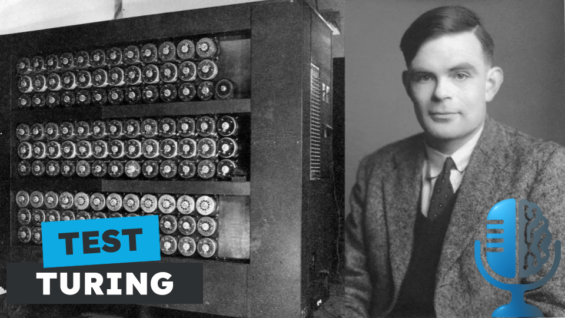

# Artículos antiguos: El test de Turing

- [ Spotify](https://open.spotify.com/episode/64rb3xPeaX1CF72nvTkb2H?si=tdwAyXZnS4aGwv0yRgNA7Q)
- [ Youtube](https://youtu.be/0GfZCUW06LY)
- [ Ivoox](https://go.ivoox.com/rf/149632307)
- [ Apple Podcasts](https://podcasts.apple.com/us/podcast/art%C3%ADculos-antiguos-el-test-de-turing/id1669083682?i=1000711851380)

Seguro que has oído hablar muchas veces del famoso test de Turing, pero ¿has leído alguna vez el artículo? En el capítulo de hoy de la tertulia desgranamos todos los detalles de este revolucionario artículo: El test de Turing

Participan en la tertulia: Josu Gorostegui, Carlos Larriú, Íñigo Olcoz y Guillermo Barbadillo.

Recuerda que puedes enviarnos dudas, comentarios y sugerencias en: <https://twitter.com/TERTUL_ia>