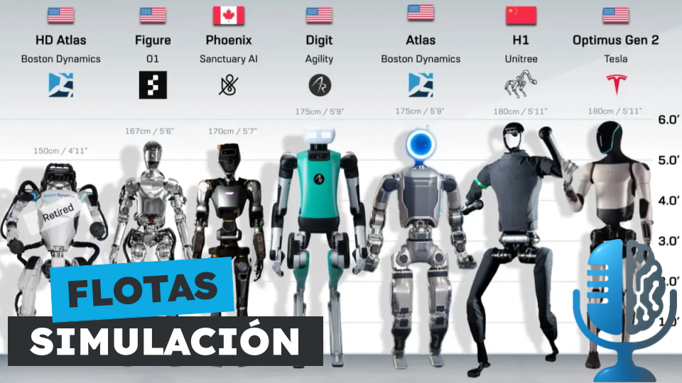

# ¿Cómo conseguir suficientes datos para entrenar un robot GPT?

- [ Spotify](https://open.spotify.com/episode/76oH2gBoJe2QTrXG5FvCWM?si=fc_SFkr6SxuAeT-y_QdXGw)
- [ Youtube](https://youtu.be/XVe3vXElv80)
- [ Ivoox](https://go.ivoox.com/rf/151223513)
- [ Apple Podcasts](https://podcasts.apple.com/us/podcast/c%C3%B3mo-conseguir-suficientes-datos-para-entrenar-un/id1669083682?i=1000714816187)

En los últimos años los robots humanoides han vuelto a ponerse de moda. Al margen del precio el principal problema es la falta de un modelo fundacional que haga que estos robots puedan ser útiles haciendo tareas. Durante décadas los humanos hemos creado internet, que ha servido para entrenar a los modelos de lenguaje, pero: ¿Cómo conseguir suficientes datos para entrenar un robot GPT?

Participan en la tertulia: Paco Zamora, Íñigo Olcoz y Guillermo Barbadillo.

Recuerda que puedes enviarnos dudas, comentarios y sugerencias en: <https://twitter.com/TERTUL_ia>