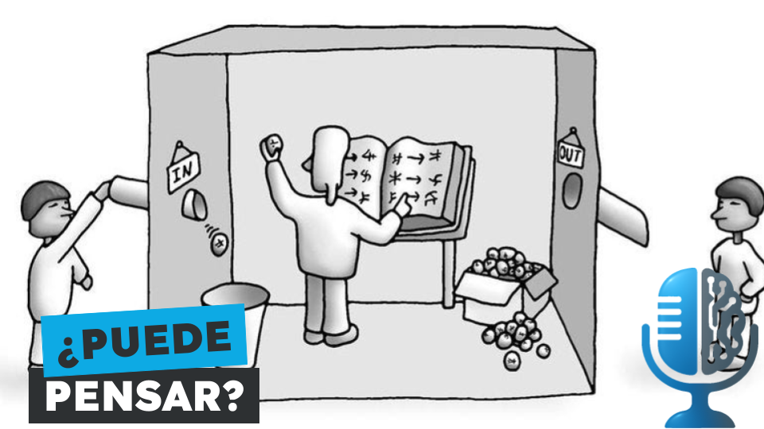

# La habitación china de Searle

- [ Spotify]()
- [ Youtube](https://youtu.be/nQAHR0zIV8E)
- [ Ivoox](https://go.ivoox.com/rf/160063588)
- [ Apple Podcasts]()

La habitación china de Searle es uno de los experimentos mentales más famosos de la historia de la IA. 
Con este experimento Searle intenta responder a una pregunta fundamental:
¿Podemos hacer que una máquina piense simplemente ejecutando el programa correcto?

Participan en la tertulia: Íñigo Olcoz y Guillermo Barbadillo.

Recuerda que puedes enviarnos dudas, comentarios y sugerencias en: <https://twitter.com/TERTUL_ia>