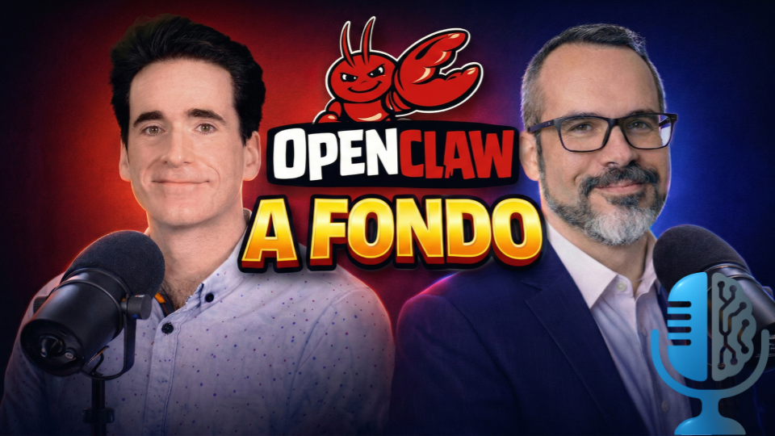

# OpenClaw: anatomía de un agente de IA

- [ Spotify](https://open.spotify.com/episode/4aPD4Ba5JJgOxABONplsty?si=hKtGoK48SyqSYoa8cnqX0w)
- [ Youtube](https://youtu.be/KAQGe9SaN3M)
- [ Ivoox](https://go.ivoox.com/rf/169234466)
- [ Apple Podcasts](https://podcasts.apple.com/us/podcast/openclaw-anatom%C3%ADa-de-un-agente-de-ia/id1669083682?i=1000751937268)

Conoce las tripas de OpenClaw en este nuevo capítulo de la Tertulia.

Participan en la tertulia: Josu Gorostegui y Guillermo Barbadillo.

Recuerda que puedes enviarnos dudas, comentarios y sugerencias en: <https://twitter.com/TERTUL_ia>