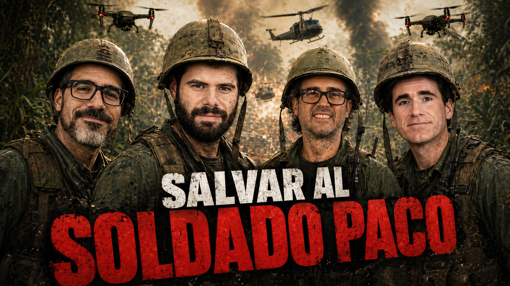

# Inteligencia Artificial en la Guerra

- [ Spotify](https://open.spotify.com/episode/33j4wyyHfj8RFjePOfKz7h?si=CsKdGDDeTYWJm6gibsBG3A)
- [ Youtube](https://youtu.be/j9HN_60DXGg)
- [ Ivoox](https://go.ivoox.com/rf/172916717)
- [ Apple Podcasts](https://podcasts.apple.com/us/podcast/inteligencia-artificial-en-la-guerra/id1669083682?i=1000765231484)

El capítulo aborda el uso de la IA en la guerra desde tres ángulos: su aplicación real en conflictos como Gaza, Ucrania e Irán; el debate político y empresarial entre Anthropic, OpenAI, EE. UU. y Palantir; y las implicaciones científicas, técnicas y éticas.
Analizaremos cómo la IA puede acelerar la selección de objetivos, automatizar vigilancia, controlar drones o apoyar tareas de inteligencia, y qué riesgos plantea para la responsabilidad humana y el derecho internacional.
La gran pregunta de fondo será si la IA es una herramienta inevitable de la guerra moderna, una nueva forma de disuasión o una frontera peligrosa que deberíamos regular antes de que sea demasiado tarde.

Participan en la tertulia: Paco Zamora, Josu Gorostegui, Iñigo Olcoz y Guillermo Barbadillo.

Recuerda que puedes enviarnos dudas, comentarios y sugerencias en: <https://twitter.com/TERTUL_ia>