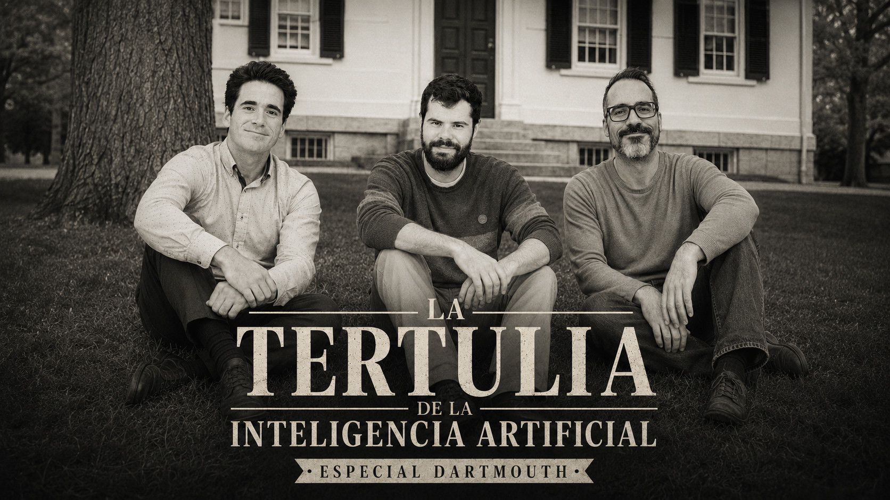

# Dartmouth (1955): Los orígenes de la IA

- [ Spotify]()
- [ Youtube](https://youtu.be/elVhfsaOb_w)
- [ Ivoox](https://go.ivoox.com/rf/174598499)
- [ Apple Podcasts]()

La conferencia de Dartmouth marca el inicio de la investigación en inteligencia artificial. Conoce qué temas trataron y otras curiosidades en este capítulo.

Participan en la tertulia: Iñigo Olcoz, Josu Gorostegui y Guillermo Barbadillo.

Recuerda que puedes enviarnos dudas, comentarios y sugerencias en: <https://twitter.com/TERTUL_ia>