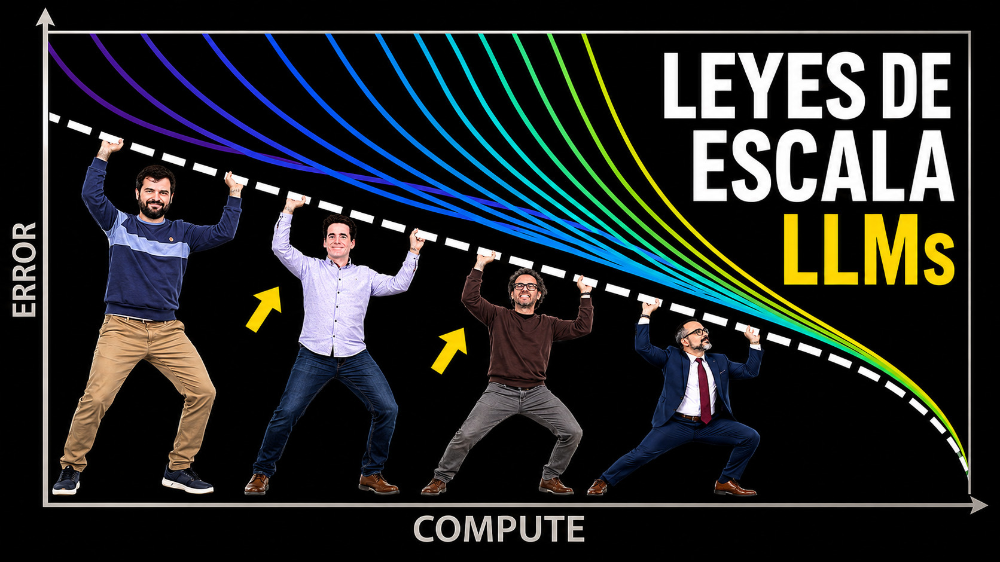

# Las leyes de escala de Amodei

- [ Spotify](https://open.spotify.com/episode/0skQ0uj9Hzd3sNddgzXiUk?si=iqIxAdATQoeOhyK-S5RLHA)
- [ Youtube](https://youtu.be/pro4grxRAVQ)
- [ Ivoox](https://go.ivoox.com/rf/176320572)
- [ Apple Podcasts](https://podcasts.apple.com/us/podcast/las-leyes-de-escala-de-amodei/id1669083682?i=1000774343503)

Las leyes de escala mostraron que los modelos de lenguaje Transformer mejoran de forma predecible al aumentar parámetros, datos y cómputo, siempre que estos escalen juntos.
Su importancia histórica fue demostrar que entrenar modelos cada vez más grandes podía producir mejoras continuas, aunque principalmente en dominios de texto parecidos al entrenamiento.
Los modelos grandes aprenden más porque sufren menos interferencia entre tareas y pueden retener señales raras o complejas, mientras que los pequeños solo compiten bien si se especializan.

Recuerda que puedes enviarnos dudas, comentarios y sugerencias en: <https://twitter.com/TERTUL_ia>