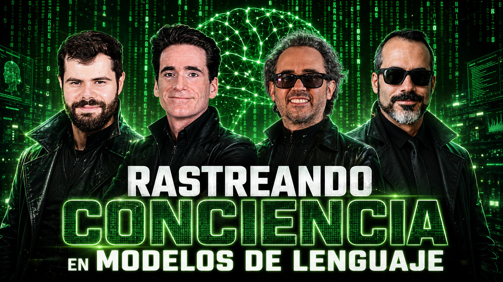

# Rastreando conciencia en modelos de lenguaje

- [ Spotify](https://open.spotify.com/episode/7ASNNiHlczrky7kvGJ0aDt?si=Ecck1XIuT_KBXSMc2iqdVg)
- [ Youtube](https://youtu.be/F4L-HZmHb3I)
- [ Ivoox](https://go.ivoox.com/rf/177473350)
- [ Apple Podcasts](https://podcasts.apple.com/us/podcast/rastreando-conciencia-en-modelos-de-lenguaje/id1669083682?i=1000777218270)

¿Es posible detectar señales parecidas a la conciencia en un modelo de lenguaje? En este episodio analizamos un estudio que aplica métricas de la neurociencia a GPT-2 para observar cómo cambia su actividad al razonar, repetir respuestas o sufrir alteraciones internas. Los resultados abren un debate sobre la organización de estos sistemas y los límites de relacionarla con una verdadera conciencia artificial.

Participan en la tertulia: Paco Zamora, Iñigo Olcoz, Josu Gorostegui y Guillermo Barbadillo.

Recuerda que puedes enviarnos dudas, comentarios y sugerencias en: <https://twitter.com/TERTUL_ia>