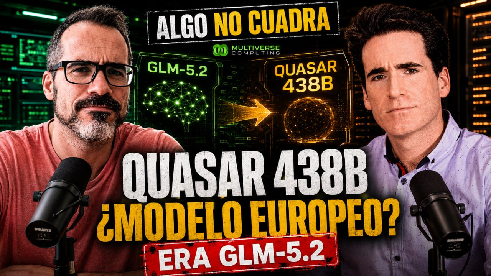

# Algo huele raro en Multiverse Computing

- [ Spotify](https://open.spotify.com/episode/0pQLlQ0GNX1pyO8aXwx8Gu?si=TFuzv61_R5GliGg3II0SLw)
- [ Youtube](https://youtu.be/0-ixopOijrw)
- [ Ivoox](https://go.ivoox.com/rf/180016604)
- [ Apple Podcasts](https://podcasts.apple.com/us/podcast/algo-huele-raro-en-multiverse-computing/id1669083682?i=1000787806155)

Analizamos la información pública sobre la empresa Multiverse Computing: a qué se dedican, inversión recibida,
el paper de Compactifai y el reciente anuncio del modelo Quasar 438B, que ha resultado ser una compresión del
modelo chino GLM 5.2.

Participan en la tertulia: Josu Gorostegui y Guillermo Barbadillo.

Recuerda que puedes enviarnos dudas, comentarios y sugerencias en: <https://twitter.com/TERTUL_ia>